January 25, 2023

This was my first project for my RMIT Grad Cert of Data Science, doing data pre-processing, initial analysis and visualisation (Matplotlob, Seaborn). The premise was that a consultancy firm was feeling a decline in work quality, possibly due to high turnover of their more senior consultants. This report was to conduct an initial analysis for any insights that might inform next steps to addressing these issues.

I knew that my second assignment was going to follow on from this, with a view to applying machine-learning/clustering techniques - so there was no need to go too deep with this first stage. Though, I enjoyed being able to identify likely clusters of relevance, even at this first stage.   

For the full Python code, [click here](images/RMIT-employee-retention-python.html){target="_blank"} - this shows all of the data wrangling/preparation and exploratory analysis and visualisation that informed the final report. There is much more in the Jupyter Notebook than ended up in the report, but this was largely intentional for two reasons:  

1. Wide exploration was helpful in getting an overview from which the specific insights were drawn; and
2. To stretch my Python skills and make the most of the learning opportunity. 

 

Below are images from the final report, prepared in Word with all plots output with Python:

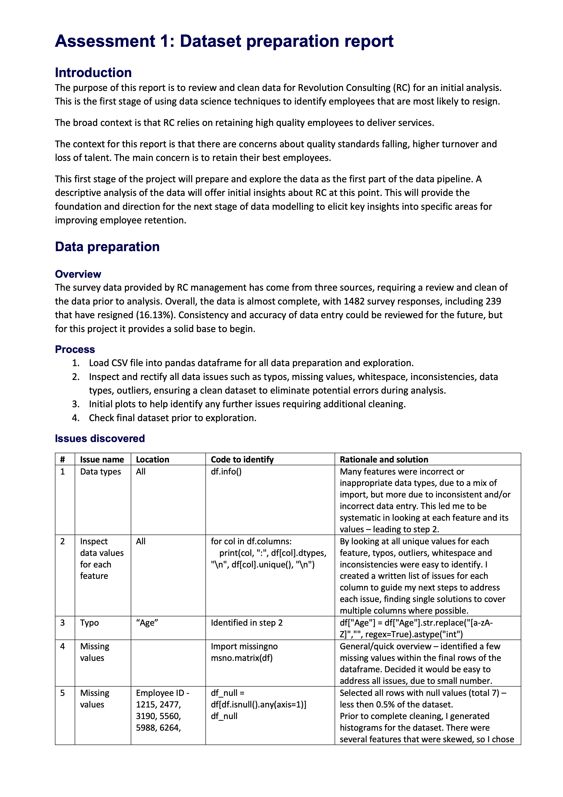

 

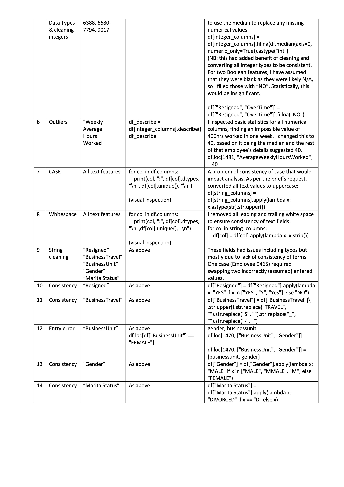

 

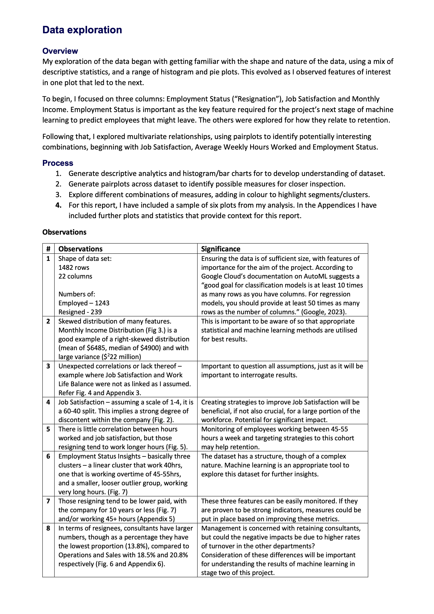

 

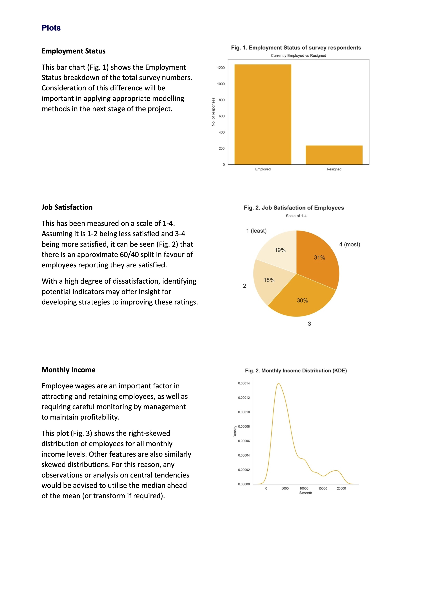

 

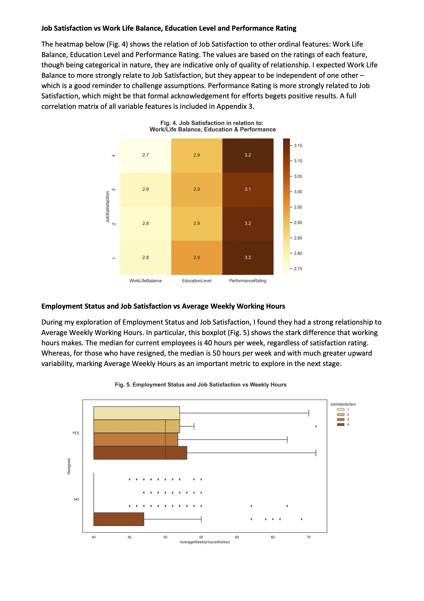

 

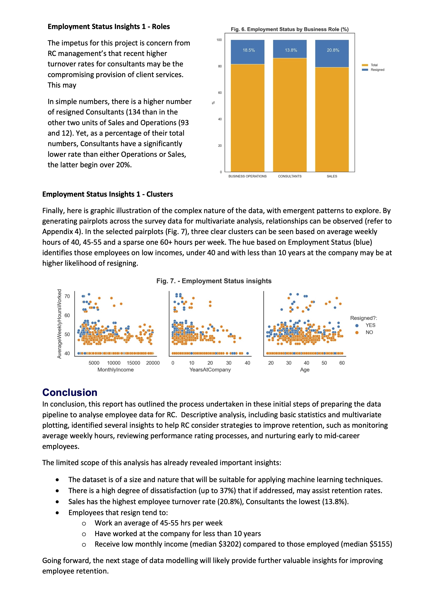

 

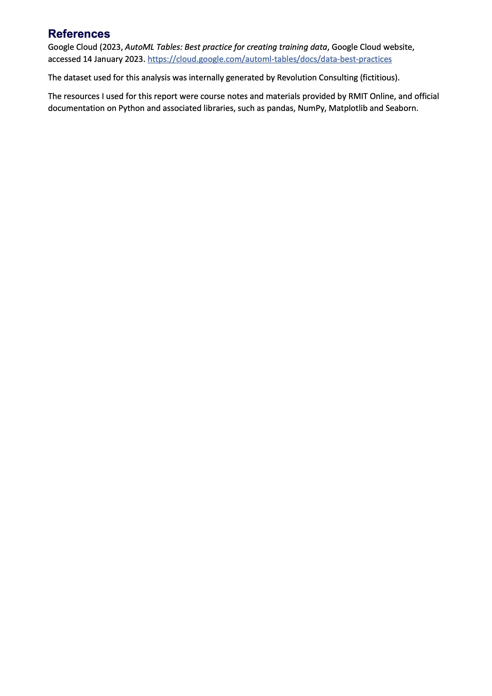

 

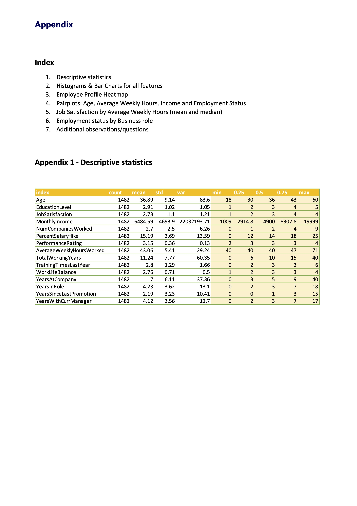

 

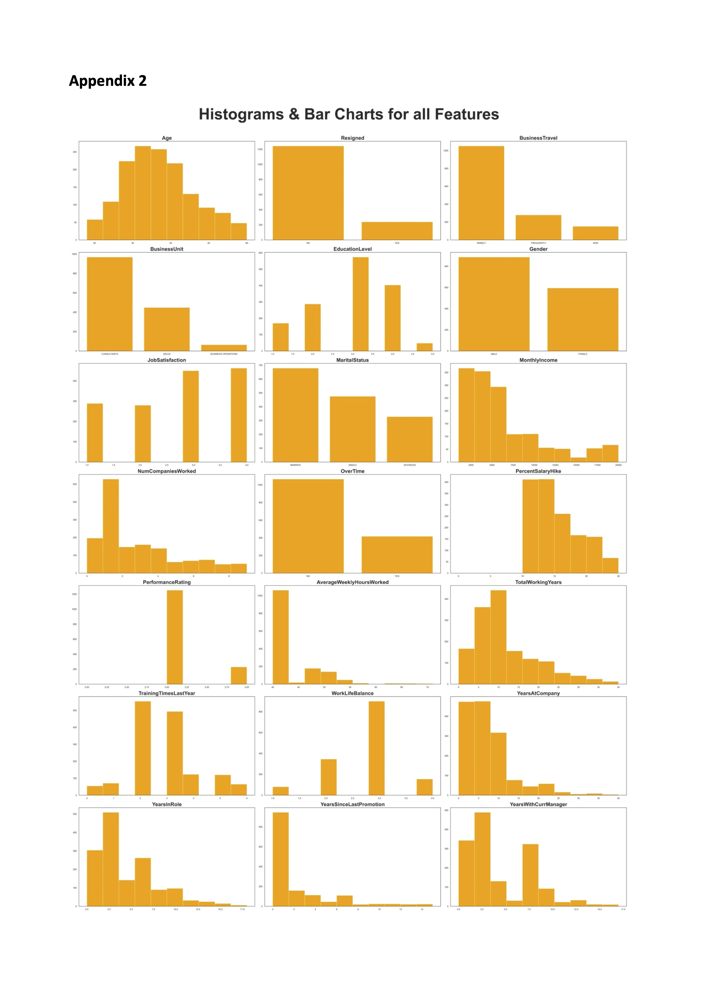

 

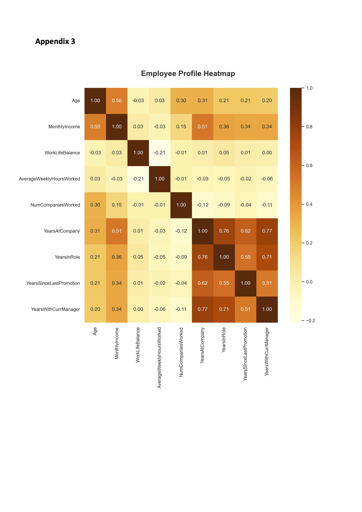

 

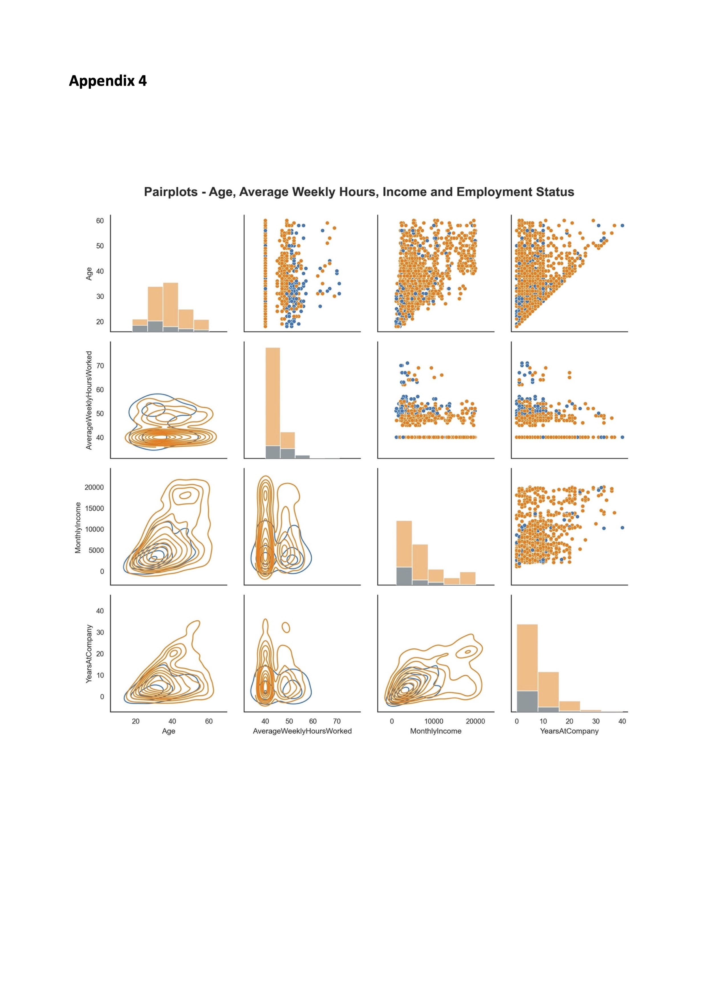

 

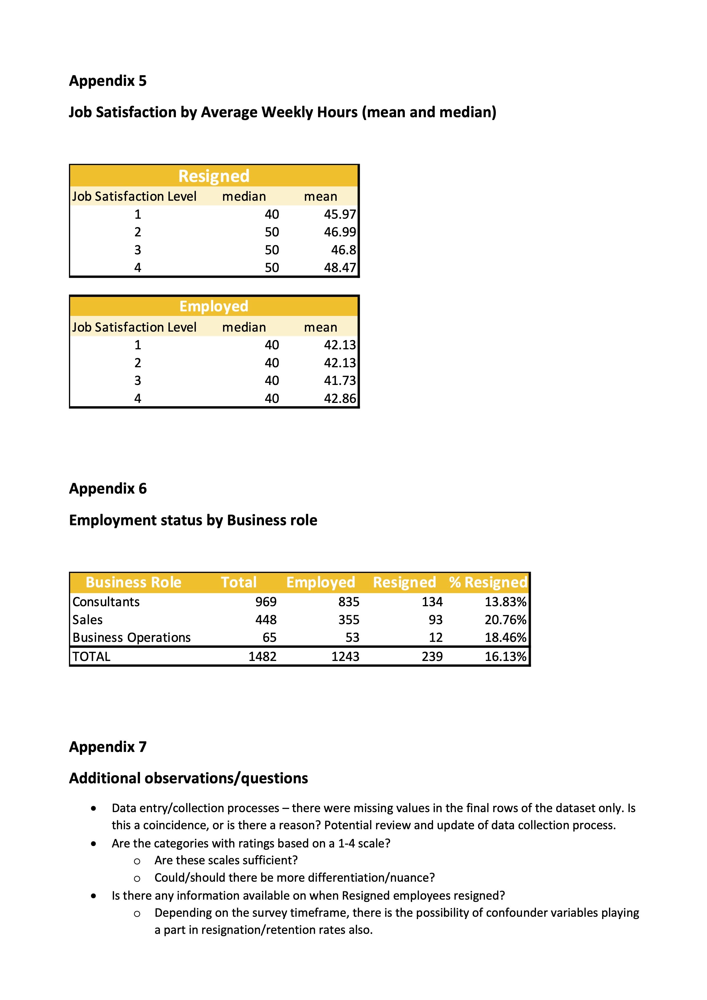

