June 15, 2023

<iframe src="https://player.vimeo.com/video/836475768?h=5fb92b17ca&amp;title=0&amp;byline=0&amp;portrait=0&amp;speed=0&amp;badge=0&amp;autopause=0&amp;player_id=0&amp;app_id=58479" frameborder="0" allow="autoplay; fullscreen; picture-in-picture" allowfullscreen style="position:absolute;top:0;left:0;width:100%;height:100%;" title="RMIT Applied Analytics - A-B Testing analysis"></iframe>

 

This is a presentation based on analysis of A/B testing of a new recommendation engine for a hypothetical streaming service, *Why Not Watch*. For the analysis, I had to clean the data, ascertain what some of the variables were (i.e. demographic and social metric), check for outliers and errors. Then in order to check for linear relationships and any differences between the A/B groups, I ran several hypothesis tests using linear regression methods, ANOVA and Z-tests. 

The data pre-processing and analysis was all done with R in RStudio. The text and plots were all output from RStudio directly to PowerPoint, where final formatting was applied. This was my final assessment for my RMIT Grad Cert and I was grateful for the learnings from my previous subjects to help with this one, especially Data Wrangling and Data Visualisation, which meant I could focus more on the statistical methods and modelling, rather than the coding/presentation nuts and bolts.

Some things I might do differently for a real-life scenario (less of the technical stuff and more polish of the verbal presentation, and make more time to address the issue of sampling bias), but overall, it was a positive and rewarding learning experience. And no complaints about the marks either. 

 

Below are static images taken from the PowerPoint presentation:

 

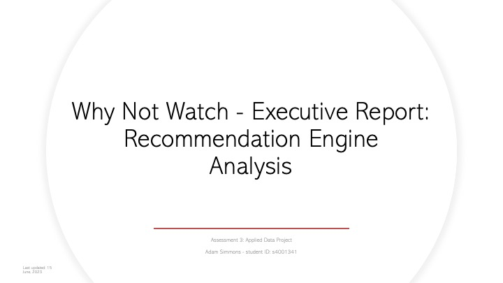

 

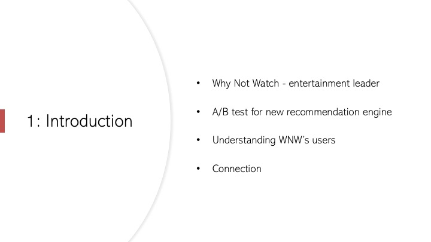

 

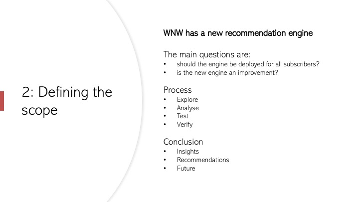

 

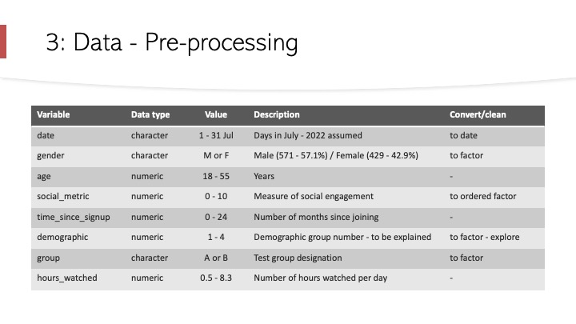

 

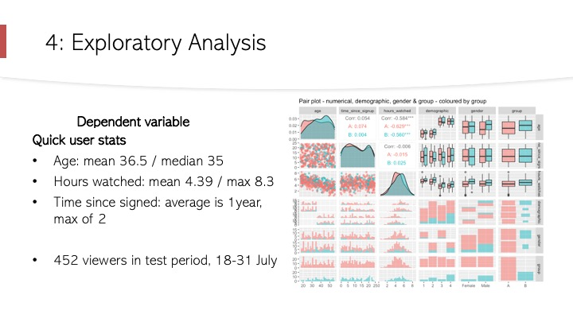

 

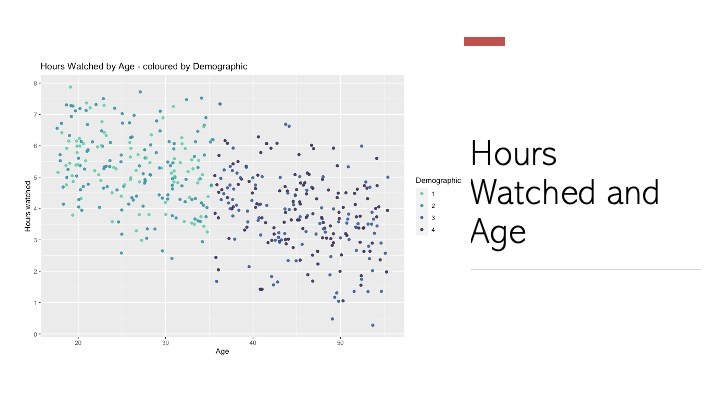

 

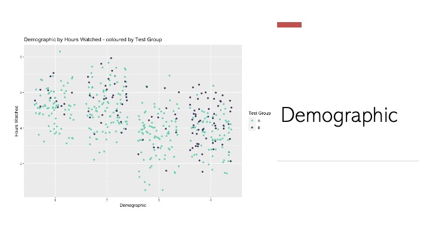

 

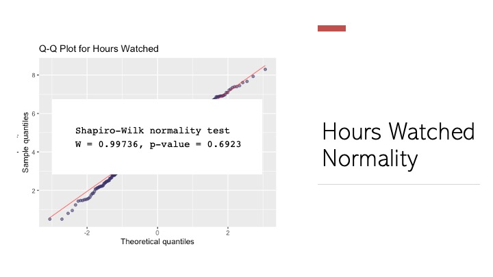

 

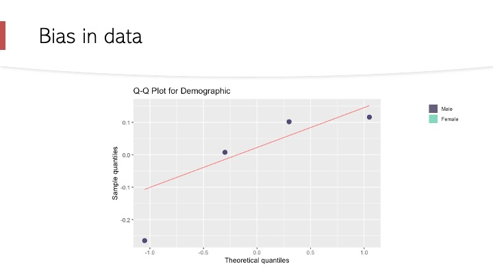

 

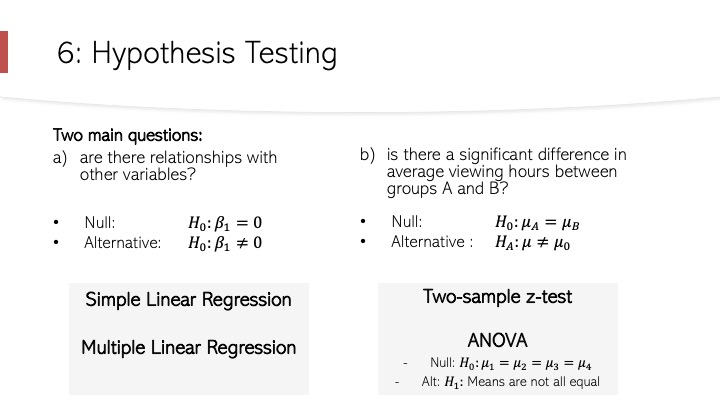

 

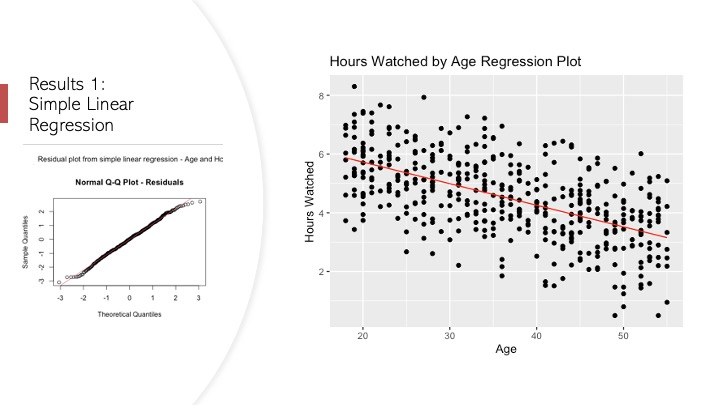

 

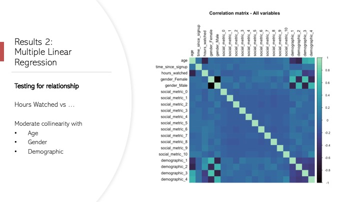

 

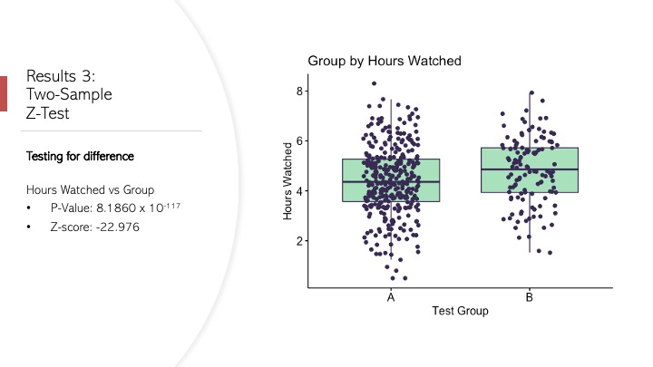

 

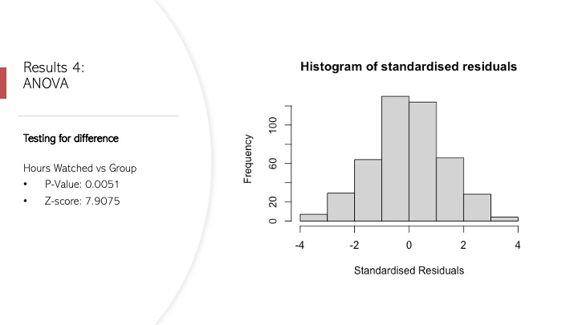

 

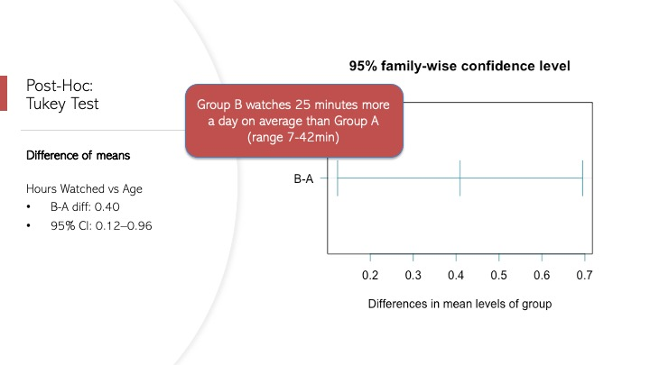

 

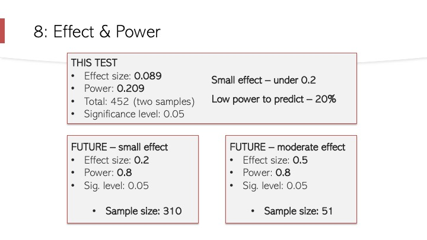

 

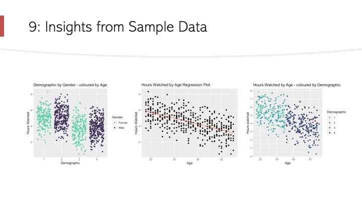

 

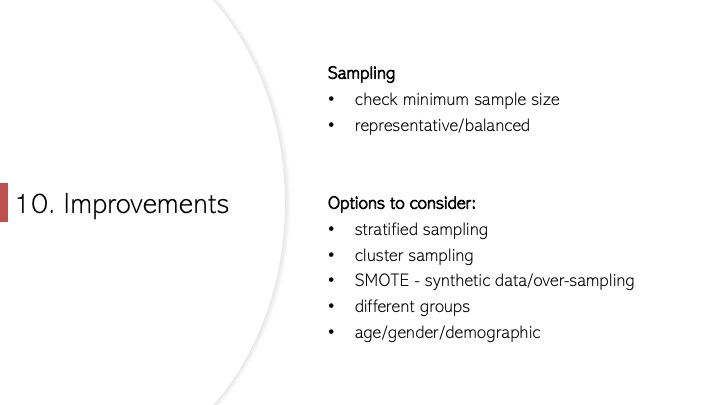

 

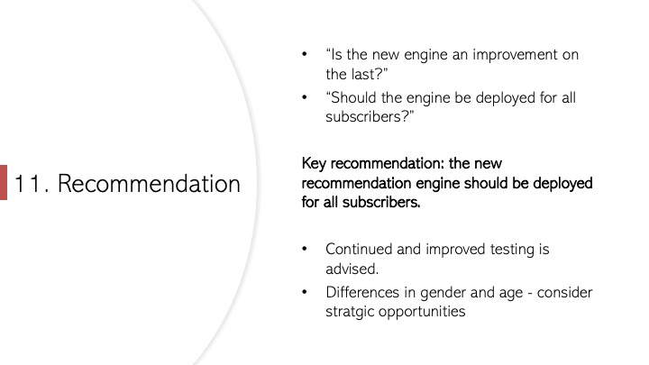

 

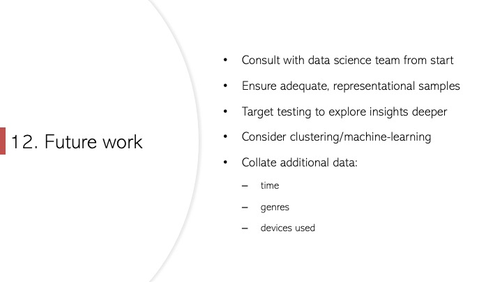

 

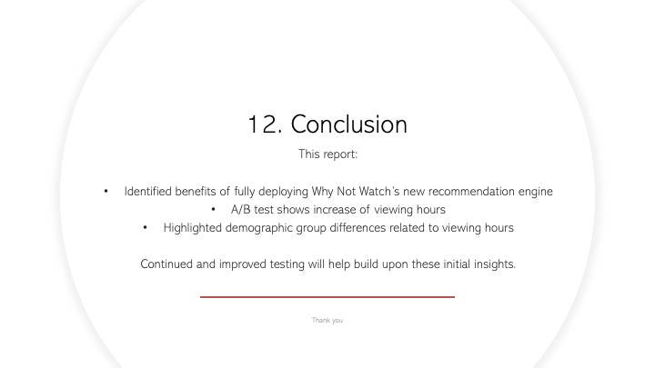

 

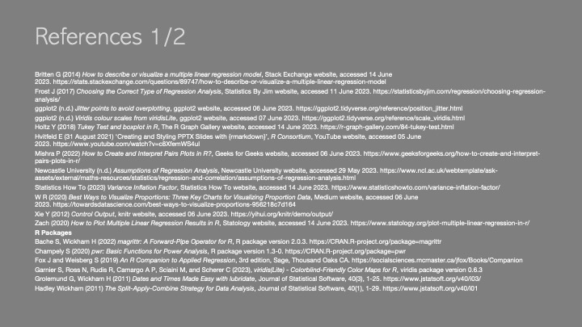

 

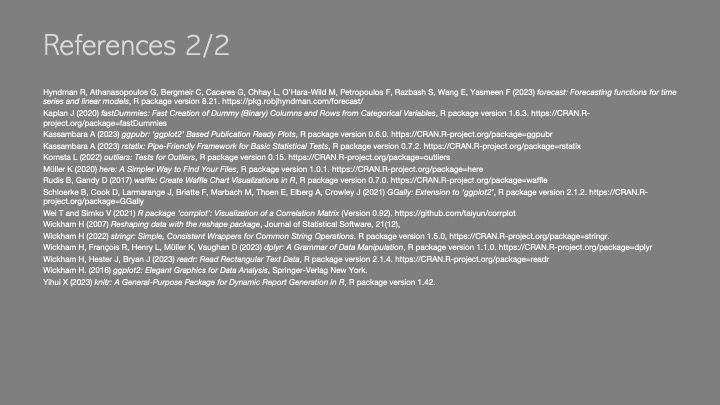

