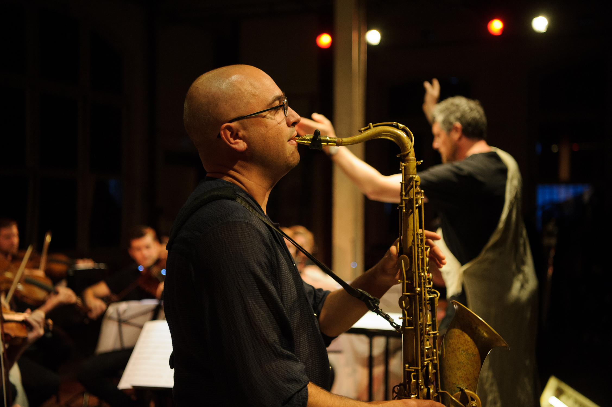
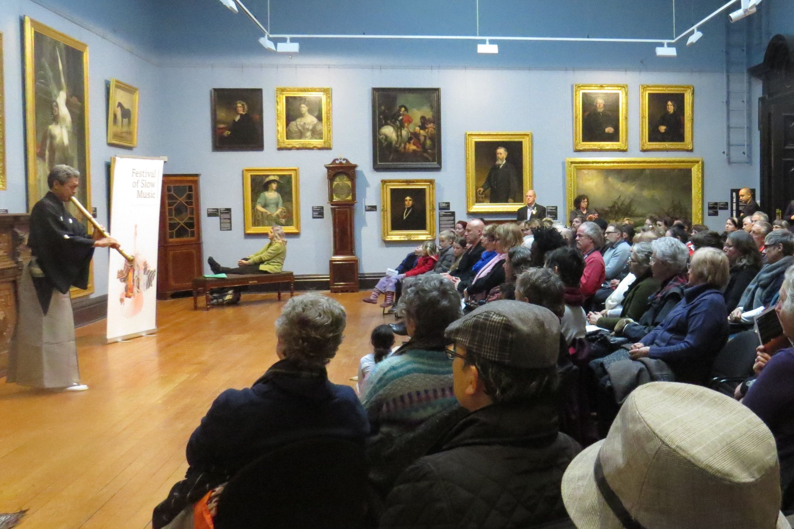
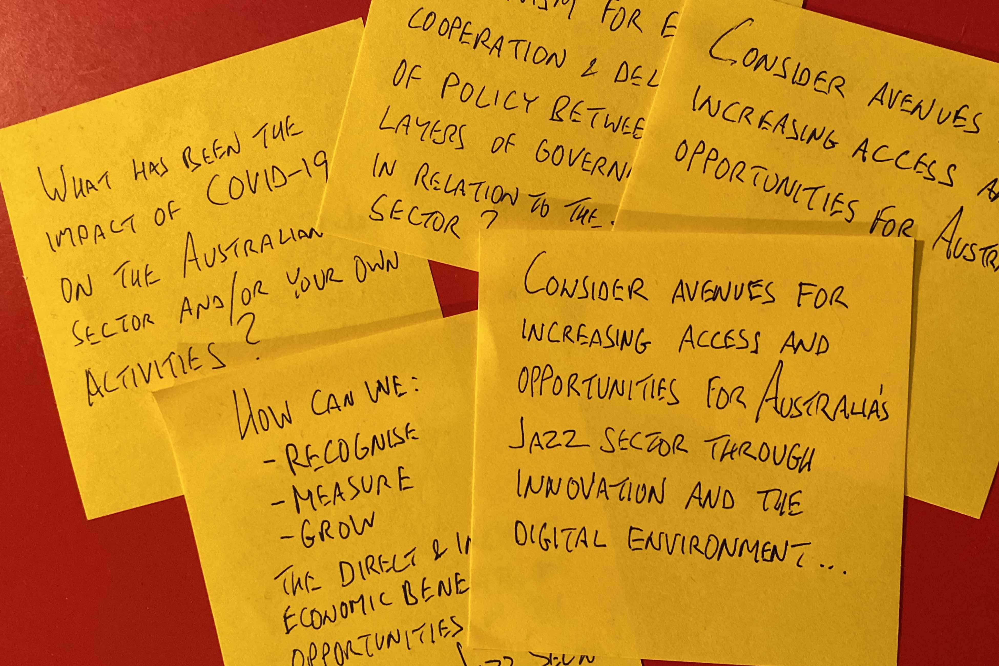
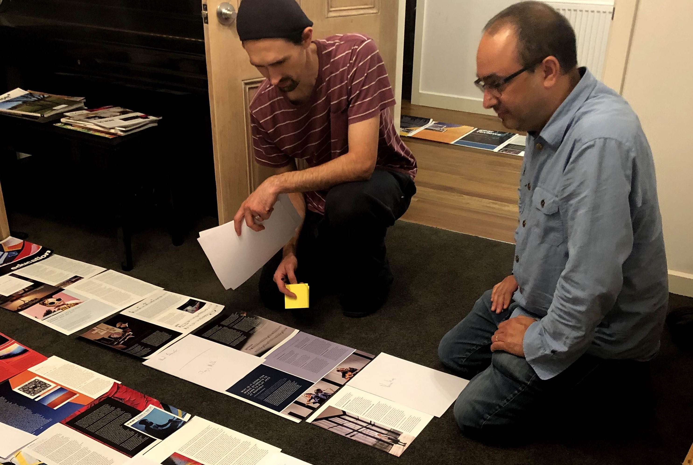

I am a Melbourne-based data specialist, with a vast and unique background in the creative industries as performer, composer, sculptor, educator, director, advocate, editor and consultant. Key to my successes have been my creative thinking, ability to adapt, willingness to learn and enjoyment of a job well done.

As a leader and promoter of my own ensembles, instigator of major events and co-founder/editor of a national magazine, I have come to understand my capacity to create something impactful because of the creative perspective, dedication and enthusiasm I bring to each project.

Below are examples of some of the arts-related projects that have developed skills that have more recently seen me successfully build a data pipeline for extracting, cleaning and analysing retail sales and customer data, as well as contribute data solutions to projects in health, education and public legislation, and complete my graduate certificate studies with distinction. 

 

<table cellpadding="40" cellspacing="20">

<tr>
<td align="center" width="45%">

</td>
<td width="10%">
</td>
<td align="center" width="45%">

</td>
</tr>

<tr>
<td valign="top">
### Leadership and Strategic Planning

- As Lead Co-Artistic Director of Wangaratta Festival of Jazz & Blues (2017-19), I established a partnership with Amersfoort Jazz Festival and the World Jazz Network, which led to export/showcase opportunities for Australian artists
- Invited member of Ballarat Live Music Advisory Committee (2016)
- Alumni of Australia Council Arts Leader Program (2017-18)
- I have led professional and community ensembles, such as the one-off Spiderbait and Wangaratta Horns of Death featuring more than 60 musicians aged 10-70.

</td>
<td>
</td>
<td valign="top">
### Project Management

- Founded, directed, promoted Festival of Slow Music, a nine-day festival in Ballarat to stimulate artistic and business activity (2013-15)
- 100:25:1 - I coordinated, promoted, performed and recorded 100 duets in one month, and conducted research for social network analysis 
- Recorded, released and promoted 26 albums - most under my own Fat Rain music label, distributed on Bandcamp, Spotify and Apple Music
- Tour management for international artists visiting Australia, coordinating major festival participation, travel logistics and promotion

</td>
</tr>

</tr>
<tr height="50px">
<td>
</td>
</tr>

<tr>
<td align="center" width="45%">

</td>
<td width="10%">
</td>
<td align="center" width="45%">

</td>
</tr>

<tr>
<td valign="top">
### Stakeholder Engagement

- Initiated the online Australian Jazz Forum 2020, to consult the national community to inform a parliamentary inquiry submission on Australia's creative industries. The result was over 80 participants representing artists, venues, organisations, education institutions, media and festivals. Collaboration was encouraged throuhgout and the final submission shared with all and made public.
- At Wangaratta Festival of Jazz & Blues, I reported directly to the board, worked with event management team, represented the artistic panel, engaged with sponsors, venue owners, accommodation, tourism, funding partners, artists, volunteers and audiences - the result was a re-invigoration of the festival community spirit, new sponsors and positive critical reviews.

</td>

<td>
</td>

<td valign="top">
### Communication

- Co-founder and Editor of Dingo, a bi-annual 116pp magazine celebrating Australian jazz, now in its 5th edition.
- Coordinated marketing campaigns including for Festival of Slow Music, Melbourne Jazz Fringe Festival and album releases
- Regularly interviewed for radio and press for event/product promotion
- Teaching group and individual lessons/workshops from primary to masters level in instrumental and music-business skills at institutions such as University of Melbourne, Melbourne Polytechnic, Blackburn High School

</td>
</tr>
</table>

 

