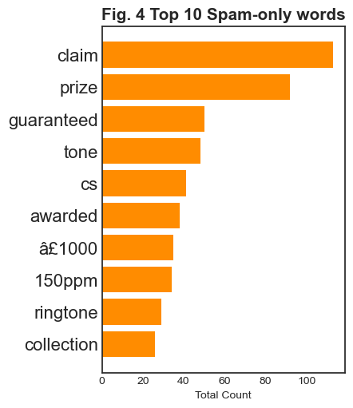
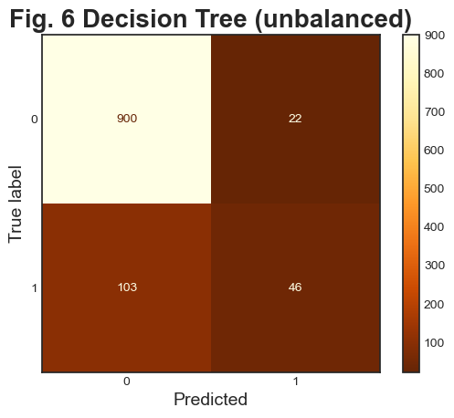

# Assignment 3: Code for data modelling presentation

__Guiding questions (from case study):__
- Is the given dataset balanced or not? 
    - You’ll need to 
        - provide evidence of your response and 
        - propose and 
        - implement an appropriate solution to solve this potential issue.
- How did you go about creating features from the data?
- How did you go about conducting the evaluation?
- How do both machine learning models compare in terms of their performance to the dataset?

# Set Up


```python
import pandas as pd
import numpy as np
import matplotlib.pyplot as plt


from sklearn.feature_extraction.text import CountVectorizer 
from sklearn.neighbors import KNeighborsClassifier 
from sklearn.tree import DecisionTreeClassifier
from sklearn import tree
from sklearn.model_selection import train_test_split 
from sklearn.model_selection import GridSearchCV 
from sklearn.metrics import accuracy_score,balanced_accuracy_score,confusion_matrix, ConfusionMatrixDisplay, classification_report 

from imblearn.over_sampling import SMOTE 

from collections import Counter

import ssl
import nltk 
from nltk.corpus import stopwords 
from nltk.tokenize import word_tokenize 
```


```python
pd.set_option("display.max_rows", 100)


# set style for plots

plt.style.use("seaborn-white")


# setting colours for plots

color ="orange"
color_r = "navajowhite"
colors = ["orange", "navajowhite"]
colors_r = list(reversed(colors))

```

    /var/folders/pb/f8gg2y7w8xjbbn0059bcyddh0000gr/T/ipykernel_47553/681184966.py:6: MatplotlibDeprecationWarning: The seaborn styles shipped by Matplotlib are deprecated since 3.6, as they no longer correspond to the styles shipped by seaborn. However, they will remain available as 'seaborn-v0_8-<style>'. Alternatively, directly use the seaborn API instead.
      plt.style.use("seaborn-white")


# Load Data


```python
df = pd.read_csv("A3_sms.csv", encoding="utf8")
```


```python
df
```


<div><div id=80efd91a-ce5f-4d4a-9e61-fb4f2ab3dc07 style="display:none; background-color:#9D6CFF; color:white; width:200px; height:30px; padding-left:5px; border-radius:4px; flex-direction:row; justify-content:space-around; align-items:center;" onmouseover="this.style.backgroundColor='#BA9BF8'" onmouseout="this.style.backgroundColor='#9D6CFF'" onclick="window.commands?.execute('create-mitosheet-from-dataframe-output');">See Full Dataframe in Mito</div> <script> if (window.commands.hasCommand('create-mitosheet-from-dataframe-output')) document.getElementById('80efd91a-ce5f-4d4a-9e61-fb4f2ab3dc07').style.display = 'flex' </script> <table border="1" class="dataframe">
  <thead>
    <tr style="text-align: right;">
      <th></th>
      <th>Unnamed: 0</th>
      <th>sms</th>
      <th>spam</th>
      <th>Unnamed: 3</th>
    </tr>
  </thead>
  <tbody>
    <tr>
      <th>0</th>
      <td>0</td>
      <td>1. Tension face 2. Smiling face 3. Waste face 4. Innocent face 5.Terror face 6.Cruel face 7.Romantic face 8.Lovable face 9.decent face &amp;lt;#&amp;gt; .joker face.</td>
      <td>False</td>
      <td>NaN</td>
    </tr>
    <tr>
      <th>1</th>
      <td>1</td>
      <td>Hhahhaahahah rofl was leonardo in your room or something</td>
      <td>False</td>
      <td>NaN</td>
    </tr>
    <tr>
      <th>2</th>
      <td>4</td>
      <td>Oh for  sake she's in like</td>
      <td>False</td>
      <td>NaN</td>
    </tr>
    <tr>
      <th>3</th>
      <td>5</td>
      <td>No da:)he is stupid da..always sending like this:)don believe any of those message.pandy is a :)</td>
      <td>False</td>
      <td>NaN</td>
    </tr>
    <tr>
      <th>4</th>
      <td>6</td>
      <td>Lul im gettin some juicy gossip at the hospital.  Oyea.</td>
      <td>False</td>
      <td>NaN</td>
    </tr>
    <tr>
      <th>...</th>
      <td>...</td>
      <td>...</td>
      <td>...</td>
      <td>...</td>
    </tr>
    <tr>
      <th>5346</th>
      <td>5348</td>
      <td>Congratulations! Thanks to a good friend U have WON the £2,000 Xmas prize. 2 claim is easy, just call 08718726971 NOW! Only 10p per minute. BT-national-rate.</td>
      <td>True</td>
      <td>NaN</td>
    </tr>
    <tr>
      <th>5347</th>
      <td>5349</td>
      <td>Congratulations - Thanks to a good friend U have WON the £2,000 Xmas prize. 2 claim is easy, just call 08712103738 NOW! Only 10p per minute. BT-national-rate</td>
      <td>True</td>
      <td>NaN</td>
    </tr>
    <tr>
      <th>5348</th>
      <td>5350</td>
      <td>URGENT! Your mobile number *************** WON a £2000 Bonus Caller prize on 10/06/03! This is the 2nd attempt to reach you! Call 09066368753 ASAP! Box 97N7QP, 150ppm</td>
      <td>True</td>
      <td>NaN</td>
    </tr>
    <tr>
      <th>5349</th>
      <td>5351</td>
      <td>URGENT! Your Mobile No was awarded a £2,000 Bonus Caller Prize on 1/08/03! This is our 2nd attempt to contact YOU! Call 0871-4719-523 BOX95QU BT National Rate</td>
      <td>True</td>
      <td>NaN</td>
    </tr>
    <tr>
      <th>5350</th>
      <td>5352</td>
      <td>Do whatever you want. You know what the rules are. We had a talk earlier this week about what had to start happening, you showing responsibility. Yet, every week it's can i bend the rule this way? What about that way? Do whatever. I'm tired of having thia same argument with you every week. And a  &amp;lt;#&amp;gt;  movie DOESNT inlude the previews. You're still getting in after 1.</td>
      <td>False</td>
      <td>NaN</td>
    </tr>
  </tbody>
</table></div>


```python
df.info()
```

    <class 'pandas.core.frame.DataFrame'>
    RangeIndex: 5351 entries, 0 to 5350
    Data columns (total 4 columns):
     #   Column      Non-Null Count  Dtype 
    ---  ------      --------------  ----- 
     0   Unnamed: 0  5351 non-null   int64 
     1   sms         5351 non-null   object
     2   spam        5351 non-null   bool  
     3   Unnamed: 3  49 non-null     object
    dtypes: bool(1), int64(1), object(2)
    memory usage: 130.8+ KB


```python
df.shape
```


    (5351, 4)


```python
df.nunique()
```


    Unnamed: 0    5351
    sms           4948
    spam             2
    Unnamed: 3       2
    dtype: int64


```python
#looking at values in each column for any issues

for col in df.columns:
    print (f"Column \"{col}\" values: ")
    print (df.loc[:, col].unique(), "\n")
```

    Column "Unnamed: 0" values: 
    [   0    1    4 ... 5350 5351 5352] 
    
    Column "sms" values: 
    ['1. Tension face 2. Smiling face 3. Waste face 4. Innocent face 5.Terror face 6.Cruel face 7.Romantic face 8.Lovable face 9.decent face &lt;#&gt; .joker face.'
     'Hhahhaahahah rofl was leonardo in your room or something'
     "Oh for  sake she's in like " ...
     'URGENT! Your mobile number *************** WON a £2000 Bonus Caller prize on 10/06/03! This is the 2nd attempt to reach you! Call 09066368753 ASAP! Box 97N7QP, 150ppm'
     'URGENT! Your Mobile No was awarded a £2,000 Bonus Caller Prize on 1/08/03! This is our 2nd attempt to contact YOU! Call 0871-4719-523 BOX95QU BT National Rate'
     "Do whatever you want. You know what the rules are. We had a talk earlier this week about what had to start happening, you showing responsibility. Yet, every week it's can i bend the rule this way? What about that way? Do whatever. I'm tired of having thia same argument with you every week. And a  &lt;#&gt;  movie DOESNT inlude the previews. You're still getting in after 1."] 
    
    Column "spam" values: 
    [False  True] 
    
    Column "Unnamed: 3" values: 
    [nan '********' '\\/\\/\\/\\/\\/'] 
    


```python
# Column 0 - basically an index number - not required for this project
# Column 1 - sms content - what our models will be using
# Column 2 - spam marker - target class for evaluating model accuracy
# Column 3 - unknown - possibly de-indentification of numbers - not required for this project

# No missing values
# No need to change data types
# SMS text is what it is, typos and all (especially as typos can be a spam indicator)... just make case consistent (lower)
# Spam - boolean - fine, no typos
```

# Clean/prepare data

From Rubric:
- Prepare raw data to ensure it is clean and ready to model as follows: Clean the data as appropriate for a textual data source (2 pts)

## Conversion to lower-case


```python
df_preparation = df["sms"].str.lower()
df_preparation.head()
```


    0    1. tension face 2. smiling face 3. waste face ...
    1    hhahhaahahah rofl was leonardo in your room or...
    2                          oh for  sake she's in like 
    3    no da:)he is stupid da..always sending like th...
    4    lul im gettin some juicy gossip at the hospita...
    Name: sms, dtype: object


## Tokenisation of emails into words:


```python
## disabling SSl check to download the package "punkt"
try:
    _create_unverified_https_context = ssl._create_unverified_context
except AttributeError:
    pass 
else:
    ssl._create_default_https_context = _create_unverified_https_context
    
# load tokens (words) 

nltk.download("punkt") 
```

    [nltk_data] Downloading package punkt to /Users/adam/nltk_data...
    [nltk_data]   Package punkt is already up-to-date!


    True


```python
df_preparation = [word_tokenize(sms) for sms in df_preparation]
df_preparation[0] #print first list item
```


    ['1.',
     'tension',
     'face',
     '2.',
     'smiling',
     'face',
     '3.',
     'waste',
     'face',
     '4.',
     'innocent',
     'face',
     '5.terror',
     'face',
     '6.cruel',
     'face',
     '7.romantic',
     'face',
     '8.lovable',
     'face',
     '9.decent',
     'face',
     '&',
     'lt',
     ';',
     '#',
     '&',
     'gt',
     ';',
     '.joker',
     'face',
     '.']


## Removing stopwords


```python
nltk.download("stopwords") 
```

    [nltk_data] Downloading package stopwords to /Users/adam/nltk_data...
    [nltk_data]   Package stopwords is already up-to-date!


    True


```python
list_stopwords=stopwords.words("english") 

list_stopwords[0:10] 
```


    ['i', 'me', 'my', 'myself', 'we', 'our', 'ours', 'ourselves', 'you', "you're"]


```python
df_preparation= [[word for word in sms if not word in list_stopwords] for sms in df_preparation] 

print(df_preparation[0:4]) 
```

    [['1.', 'tension', 'face', '2.', 'smiling', 'face', '3.', 'waste', 'face', '4.', 'innocent', 'face', '5.terror', 'face', '6.cruel', 'face', '7.romantic', 'face', '8.lovable', 'face', '9.decent', 'face', '&', 'lt', ';', '#', '&', 'gt', ';', '.joker', 'face', '.'], ['hhahhaahahah', 'rofl', 'leonardo', 'room', 'something'], ['oh', 'sake', "'s", 'like'], ['da', ':', ')', 'stupid', 'da', '..', 'always', 'sending', 'like', ':', ')', 'believe', 'message.pandy', ':', ')']]


```python
df_words = df.copy()
df_words["words"] = df_preparation

```


```python
# dataset for checking most frequent words

df_words.head()
```


<div><div id=19cbe5c3-0649-47df-84cd-9838dbffdb69 style="display:none; background-color:#9D6CFF; color:white; width:200px; height:30px; padding-left:5px; border-radius:4px; flex-direction:row; justify-content:space-around; align-items:center;" onmouseover="this.style.backgroundColor='#BA9BF8'" onmouseout="this.style.backgroundColor='#9D6CFF'" onclick="window.commands?.execute('create-mitosheet-from-dataframe-output');">See Full Dataframe in Mito</div> <script> if (window.commands.hasCommand('create-mitosheet-from-dataframe-output')) document.getElementById('19cbe5c3-0649-47df-84cd-9838dbffdb69').style.display = 'flex' </script> <table border="1" class="dataframe">
  <thead>
    <tr style="text-align: right;">
      <th></th>
      <th>Unnamed: 0</th>
      <th>sms</th>
      <th>spam</th>
      <th>Unnamed: 3</th>
      <th>words</th>
    </tr>
  </thead>
  <tbody>
    <tr>
      <th>0</th>
      <td>0</td>
      <td>1. Tension face 2. Smiling face 3. Waste face 4. Innocent face 5.Terror face 6.Cruel face 7.Romantic face 8.Lovable face 9.decent face &amp;lt;#&amp;gt; .joker face.</td>
      <td>False</td>
      <td>NaN</td>
      <td>[1., tension, face, 2., smiling, face, 3., waste, face, 4., innocent, face, 5.terror, face, 6.cruel, face, 7.romantic, face, 8.lovable, face, 9.decent, face, &amp;, lt, ;, #, &amp;, gt, ;, .joker, face, .]</td>
    </tr>
    <tr>
      <th>1</th>
      <td>1</td>
      <td>Hhahhaahahah rofl was leonardo in your room or something</td>
      <td>False</td>
      <td>NaN</td>
      <td>[hhahhaahahah, rofl, leonardo, room, something]</td>
    </tr>
    <tr>
      <th>2</th>
      <td>4</td>
      <td>Oh for  sake she's in like</td>
      <td>False</td>
      <td>NaN</td>
      <td>[oh, sake, 's, like]</td>
    </tr>
    <tr>
      <th>3</th>
      <td>5</td>
      <td>No da:)he is stupid da..always sending like this:)don believe any of those message.pandy is a :)</td>
      <td>False</td>
      <td>NaN</td>
      <td>[da, :, ), stupid, da, .., always, sending, like, :, ), believe, message.pandy, :, )]</td>
    </tr>
    <tr>
      <th>4</th>
      <td>6</td>
      <td>Lul im gettin some juicy gossip at the hospital.  Oyea.</td>
      <td>False</td>
      <td>NaN</td>
      <td>[lul, im, gettin, juicy, gossip, hospital, ., oyea, .]</td>
    </tr>
  </tbody>
</table></div>


# Explore Data

From Rubric:
- Apply exploratory methods as appropriate to textual data. Marks will be awarded as follows:
1. Explore the dataset to check if the data is balanced (1 pt)
2. Extract features from the data using Count Vectorizor (2 pts)
3. Identify the most common words for spam and ham sms messages (2 pts)

## Check if balanced


```python
len(df[df["spam"]==True])/len(df)
```


    0.13156419360867128


```python
df_spam = df[df["spam"]==True]
df_ham = df[df["spam"]==False]

shape_spam = df_spam.shape
shape_ham = df_ham.shape

total = df.shape[0]
num_spam = shape_spam[0] 
num_ham = shape_ham[0]


print (f"Spam: {shape_spam[0]} - {round(num_spam/total * 100, 2)}%")
print (f"Ham: {shape_ham[0]} - {round(num_ham/total * 100, 2)}%")

```

    Spam: 704 - 13.16%
    Ham: 4647 - 86.84%


Unbalanced
- Spam 704 - approx 13%
- Ham 4647 - approx 87%


```python
labels = ["Spam\n ("+str(shape_spam[0])+")", "Ham  \n("+str(shape_ham[0])+")"]
counts = [shape_spam[0], shape_ham[0]]

title = "Fig. 1 Spam vs Ham"

    
plt.pie(counts
          , labels = labels
          , colors = colors_r
          , counterclock = True
          , startangle = 0
          , labeldistance = 1.2
          , pctdistance = 0.65
          , autopct = lambda p: f"{int(p)}%"
          , textprops={"fontsize": 16}  
       )

plt.title(f"{title}", fontsize=18, fontweight="bold")


plt.savefig(f"Fig. 1 {title}.png", dpi=300, transparent=True, bbox_inches = "tight")


plt.show()
```


    

    


## Extract features - Count Vectorizer

#### Feature extraction


```python
# Feature extraction

CountVec = CountVectorizer(lowercase=True,analyzer="word",stop_words="english") 
```


```python
# Get feature vectors

feature_vectors = CountVec.fit_transform(df["sms"]) 
```


```python
# Prints all strings - commented out for purposes of length
# for x in CountVec.get_feature_names_out():
#    print(x, end=", ")
```


```python
feature_vectors
```


    <5351x8011 sparse matrix of type '<class 'numpy.int64'>'
    	with 40832 stored elements in Compressed Sparse Row format>


## Identify most common words for spam and ham SMS messages


```python
# Investigate word frequency

# Create "spam" and "ham" subsets (using the dataset with tokenised emails)

#filter
df_words_spam = df_words[df_words["spam"]==True]
df_words_ham = df_words[df_words["spam"]==False]


# Get the most frequent words for each subset

word_counts_spam = df_words_spam["words"].apply(pd.Series).stack().value_counts()
word_counts_ham = df_words_ham["words"].apply(pd.Series).stack().value_counts()
```


```python
word_counts_spam.head(35)
```


    .             846
    !             508
    ,             351
    call          333
    free          209
    &             165
    ?             163
    :             161
    2             160
    txt           143
    ur            141
    u             126
    mobile        121
    *             113
    claim         113
    4             110
    text          101
    stop          101
    reply          97
    prize          92
    get            76
    nokia          65
    send           64
    's             63
    urgent         63
    new            63
    cash           62
    win            60
    )              58
    contact        56
    please         54
    week           52
    -              52
    guaranteed     50
    service        49
    dtype: int64


```python
word_counts_ham.head(35)
```


    .        3644
    ,        1457
    ?        1307
    ...      1067
    u         939
    !         763
    ;         745
    &         724
    ..        675
    :         537
    )         420
    's        405
    'm        375
    n't       310
    gt        309
    lt        309
    2         287
    get       285
    #         275
    go        241
    ok        240
    ur        238
    got       236
    come      227
    call      226
    'll       223
    good      223
    know      219
    like      215
    time      190
    day       188
    -         171
    love      170
    4         165
    going     164
    dtype: int64


```python
# checking number of words in spam and ham - 

word_counts_spam.shape, word_counts_ham.shape
```


    ((2808,), (6933,))


```python
# convert to pandas datasets for joining/filtering

word_counts_spam = pd.DataFrame(word_counts_spam).reset_index()
word_counts_ham = pd.DataFrame(word_counts_ham).reset_index()

```


```python
# setting "type" to be able to filter later by "spam" and "ham"

word_counts_spam ["type"] = "spam"
word_counts_spam
```


<div><div id=963074f3-8ce9-4e62-966b-26a13996e2bd style="display:none; background-color:#9D6CFF; color:white; width:200px; height:30px; padding-left:5px; border-radius:4px; flex-direction:row; justify-content:space-around; align-items:center;" onmouseover="this.style.backgroundColor='#BA9BF8'" onmouseout="this.style.backgroundColor='#9D6CFF'" onclick="window.commands?.execute('create-mitosheet-from-dataframe-output');">See Full Dataframe in Mito</div> <script> if (window.commands.hasCommand('create-mitosheet-from-dataframe-output')) document.getElementById('963074f3-8ce9-4e62-966b-26a13996e2bd').style.display = 'flex' </script> <table border="1" class="dataframe">
  <thead>
    <tr style="text-align: right;">
      <th></th>
      <th>index</th>
      <th>0</th>
      <th>type</th>
    </tr>
  </thead>
  <tbody>
    <tr>
      <th>0</th>
      <td>.</td>
      <td>846</td>
      <td>spam</td>
    </tr>
    <tr>
      <th>1</th>
      <td>!</td>
      <td>508</td>
      <td>spam</td>
    </tr>
    <tr>
      <th>2</th>
      <td>,</td>
      <td>351</td>
      <td>spam</td>
    </tr>
    <tr>
      <th>3</th>
      <td>call</td>
      <td>333</td>
      <td>spam</td>
    </tr>
    <tr>
      <th>4</th>
      <td>free</td>
      <td>209</td>
      <td>spam</td>
    </tr>
    <tr>
      <th>...</th>
      <td>...</td>
      <td>...</td>
      <td>...</td>
    </tr>
    <tr>
      <th>2803</th>
      <td>08704439680.</td>
      <td>1</td>
      <td>spam</td>
    </tr>
    <tr>
      <th>2804</th>
      <td>passes</td>
      <td>1</td>
      <td>spam</td>
    </tr>
    <tr>
      <th>2805</th>
      <td>lounge</td>
      <td>1</td>
      <td>spam</td>
    </tr>
    <tr>
      <th>2806</th>
      <td>airport</td>
      <td>1</td>
      <td>spam</td>
    </tr>
    <tr>
      <th>2807</th>
      <td>0871-4719-523</td>
      <td>1</td>
      <td>spam</td>
    </tr>
  </tbody>
</table></div>


```python
word_counts_ham ["type"] = "ham"
word_counts_ham
```


<div><div id=d8b4bb31-dfa7-4d8b-8c93-0cf9caa726ab style="display:none; background-color:#9D6CFF; color:white; width:200px; height:30px; padding-left:5px; border-radius:4px; flex-direction:row; justify-content:space-around; align-items:center;" onmouseover="this.style.backgroundColor='#BA9BF8'" onmouseout="this.style.backgroundColor='#9D6CFF'" onclick="window.commands?.execute('create-mitosheet-from-dataframe-output');">See Full Dataframe in Mito</div> <script> if (window.commands.hasCommand('create-mitosheet-from-dataframe-output')) document.getElementById('d8b4bb31-dfa7-4d8b-8c93-0cf9caa726ab').style.display = 'flex' </script> <table border="1" class="dataframe">
  <thead>
    <tr style="text-align: right;">
      <th></th>
      <th>index</th>
      <th>0</th>
      <th>type</th>
    </tr>
  </thead>
  <tbody>
    <tr>
      <th>0</th>
      <td>.</td>
      <td>3644</td>
      <td>ham</td>
    </tr>
    <tr>
      <th>1</th>
      <td>,</td>
      <td>1457</td>
      <td>ham</td>
    </tr>
    <tr>
      <th>2</th>
      <td>?</td>
      <td>1307</td>
      <td>ham</td>
    </tr>
    <tr>
      <th>3</th>
      <td>...</td>
      <td>1067</td>
      <td>ham</td>
    </tr>
    <tr>
      <th>4</th>
      <td>u</td>
      <td>939</td>
      <td>ham</td>
    </tr>
    <tr>
      <th>...</th>
      <td>...</td>
      <td>...</td>
      <td>...</td>
    </tr>
    <tr>
      <th>6928</th>
      <td>andre</td>
      <td>1</td>
      <td>ham</td>
    </tr>
    <tr>
      <th>6929</th>
      <td>virgil</td>
      <td>1</td>
      <td>ham</td>
    </tr>
    <tr>
      <th>6930</th>
      <td>dismay</td>
      <td>1</td>
      <td>ham</td>
    </tr>
    <tr>
      <th>6931</th>
      <td>enjoying</td>
      <td>1</td>
      <td>ham</td>
    </tr>
    <tr>
      <th>6932</th>
      <td>previews</td>
      <td>1</td>
      <td>ham</td>
    </tr>
  </tbody>
</table></div>


```python
len(df_words_spam), len(df_words_ham)
```


    (704, 4647)


```python
all_words = pd.concat([word_counts_spam, word_counts_ham], axis=0).rename(columns={"index": "word", 0: "count"}).reset_index(drop=True)
all_words
```


<div><div id=b91049e5-83ca-46ee-b5cd-8d018fe49d36 style="display:none; background-color:#9D6CFF; color:white; width:200px; height:30px; padding-left:5px; border-radius:4px; flex-direction:row; justify-content:space-around; align-items:center;" onmouseover="this.style.backgroundColor='#BA9BF8'" onmouseout="this.style.backgroundColor='#9D6CFF'" onclick="window.commands?.execute('create-mitosheet-from-dataframe-output');">See Full Dataframe in Mito</div> <script> if (window.commands.hasCommand('create-mitosheet-from-dataframe-output')) document.getElementById('b91049e5-83ca-46ee-b5cd-8d018fe49d36').style.display = 'flex' </script> <table border="1" class="dataframe">
  <thead>
    <tr style="text-align: right;">
      <th></th>
      <th>word</th>
      <th>count</th>
      <th>type</th>
    </tr>
  </thead>
  <tbody>
    <tr>
      <th>0</th>
      <td>.</td>
      <td>846</td>
      <td>spam</td>
    </tr>
    <tr>
      <th>1</th>
      <td>!</td>
      <td>508</td>
      <td>spam</td>
    </tr>
    <tr>
      <th>2</th>
      <td>,</td>
      <td>351</td>
      <td>spam</td>
    </tr>
    <tr>
      <th>3</th>
      <td>call</td>
      <td>333</td>
      <td>spam</td>
    </tr>
    <tr>
      <th>4</th>
      <td>free</td>
      <td>209</td>
      <td>spam</td>
    </tr>
    <tr>
      <th>...</th>
      <td>...</td>
      <td>...</td>
      <td>...</td>
    </tr>
    <tr>
      <th>9736</th>
      <td>andre</td>
      <td>1</td>
      <td>ham</td>
    </tr>
    <tr>
      <th>9737</th>
      <td>virgil</td>
      <td>1</td>
      <td>ham</td>
    </tr>
    <tr>
      <th>9738</th>
      <td>dismay</td>
      <td>1</td>
      <td>ham</td>
    </tr>
    <tr>
      <th>9739</th>
      <td>enjoying</td>
      <td>1</td>
      <td>ham</td>
    </tr>
    <tr>
      <th>9740</th>
      <td>previews</td>
      <td>1</td>
      <td>ham</td>
    </tr>
  </tbody>
</table></div>


```python
all_words.shape
```


    (9741, 3)


```python

#remove all duplicates (keep neither) to keep only unique words
ham_or_spam = all_words.drop_duplicates(subset=["word"], keep=False)

#remove all words only found in "ham" - keep "spam"
spam_words_only = ham_or_spam[ham_or_spam["type"]=="spam"].reset_index(drop=True)

spam_words_only
```


<div><div id=7d86a5d6-f0af-4eb8-aeba-e04ef8bbc1e8 style="display:none; background-color:#9D6CFF; color:white; width:200px; height:30px; padding-left:5px; border-radius:4px; flex-direction:row; justify-content:space-around; align-items:center;" onmouseover="this.style.backgroundColor='#BA9BF8'" onmouseout="this.style.backgroundColor='#9D6CFF'" onclick="window.commands?.execute('create-mitosheet-from-dataframe-output');">See Full Dataframe in Mito</div> <script> if (window.commands.hasCommand('create-mitosheet-from-dataframe-output')) document.getElementById('7d86a5d6-f0af-4eb8-aeba-e04ef8bbc1e8').style.display = 'flex' </script> <table border="1" class="dataframe">
  <thead>
    <tr style="text-align: right;">
      <th></th>
      <th>word</th>
      <th>count</th>
      <th>type</th>
    </tr>
  </thead>
  <tbody>
    <tr>
      <th>0</th>
      <td>claim</td>
      <td>113</td>
      <td>spam</td>
    </tr>
    <tr>
      <th>1</th>
      <td>prize</td>
      <td>92</td>
      <td>spam</td>
    </tr>
    <tr>
      <th>2</th>
      <td>guaranteed</td>
      <td>50</td>
      <td>spam</td>
    </tr>
    <tr>
      <th>3</th>
      <td>tone</td>
      <td>48</td>
      <td>spam</td>
    </tr>
    <tr>
      <th>4</th>
      <td>cs</td>
      <td>41</td>
      <td>spam</td>
    </tr>
    <tr>
      <th>...</th>
      <td>...</td>
      <td>...</td>
      <td>...</td>
    </tr>
    <tr>
      <th>1903</th>
      <td>villa</td>
      <td>1</td>
      <td>spam</td>
    </tr>
    <tr>
      <th>1904</th>
      <td>someonone</td>
      <td>1</td>
      <td>spam</td>
    </tr>
    <tr>
      <th>1905</th>
      <td>08704439680.</td>
      <td>1</td>
      <td>spam</td>
    </tr>
    <tr>
      <th>1906</th>
      <td>passes</td>
      <td>1</td>
      <td>spam</td>
    </tr>
    <tr>
      <th>1907</th>
      <td>0871-4719-523</td>
      <td>1</td>
      <td>spam</td>
    </tr>
  </tbody>
</table></div>


```python
print (spam_words_only.head(30))
```

              word  count  type
    0        claim    113  spam
    1        prize     92  spam
    2   guaranteed     50  spam
    3         tone     48  spam
    4           cs     41  spam
    5      awarded     38  spam
    6       â£1000     35  spam
    7       150ppm     34  spam
    8     ringtone     29  spam
    9   collection     26  spam
    10       tones     26  spam
    11       entry     25  spam
    12         16+     25  spam
    13      weekly     24  spam
    14         mob     23  spam
    15       valid     23  spam
    16         500     23  spam
    17       â£100     22  spam
    18        150p     21  spam
    19         sae     21  spam
    20    delivery     21  spam
    21        8007     21  spam
    22       bonus     21  spam
    23    vouchers     20  spam
    24      â£2000     20  spam
    25      â£5000     20  spam
    26       86688     19  spam
    27          18     19  spam
    28       â£500     19  spam
    29         750     18  spam


```python
ham_words_only = ham_or_spam[ham_or_spam["type"]=="ham"].reset_index(drop=True)

ham_words_only
```


<div><div id=85f01614-71a0-4f86-bf27-2a7202a92e78 style="display:none; background-color:#9D6CFF; color:white; width:200px; height:30px; padding-left:5px; border-radius:4px; flex-direction:row; justify-content:space-around; align-items:center;" onmouseover="this.style.backgroundColor='#BA9BF8'" onmouseout="this.style.backgroundColor='#9D6CFF'" onclick="window.commands?.execute('create-mitosheet-from-dataframe-output');">See Full Dataframe in Mito</div> <script> if (window.commands.hasCommand('create-mitosheet-from-dataframe-output')) document.getElementById('85f01614-71a0-4f86-bf27-2a7202a92e78').style.display = 'flex' </script> <table border="1" class="dataframe">
  <thead>
    <tr style="text-align: right;">
      <th></th>
      <th>word</th>
      <th>count</th>
      <th>type</th>
    </tr>
  </thead>
  <tbody>
    <tr>
      <th>0</th>
      <td>gt</td>
      <td>309</td>
      <td>ham</td>
    </tr>
    <tr>
      <th>1</th>
      <td>lt</td>
      <td>309</td>
      <td>ham</td>
    </tr>
    <tr>
      <th>2</th>
      <td>lor</td>
      <td>162</td>
      <td>ham</td>
    </tr>
    <tr>
      <th>3</th>
      <td>da</td>
      <td>137</td>
      <td>ham</td>
    </tr>
    <tr>
      <th>4</th>
      <td>later</td>
      <td>130</td>
      <td>ham</td>
    </tr>
    <tr>
      <th>...</th>
      <td>...</td>
      <td>...</td>
      <td>...</td>
    </tr>
    <tr>
      <th>6028</th>
      <td>andre</td>
      <td>1</td>
      <td>ham</td>
    </tr>
    <tr>
      <th>6029</th>
      <td>virgil</td>
      <td>1</td>
      <td>ham</td>
    </tr>
    <tr>
      <th>6030</th>
      <td>dismay</td>
      <td>1</td>
      <td>ham</td>
    </tr>
    <tr>
      <th>6031</th>
      <td>enjoying</td>
      <td>1</td>
      <td>ham</td>
    </tr>
    <tr>
      <th>6032</th>
      <td>previews</td>
      <td>1</td>
      <td>ham</td>
    </tr>
  </tbody>
</table></div>


```python
print (ham_words_only.head(30))
```

             word  count type
    0          gt    309  ham
    1          lt    309  ham
    2         lor    162  ham
    3          da    137  ham
    4       later    130  ham
    5          ã¼    120  ham
    6       happy    104  ham
    7         amp     88  ham
    8        work     88  ham
    9         ask     88  ham
    10       said     79  ham
    11        lol     74  ham
    12   anything     73  ham
    13        cos     72  ham
    14    morning     71  ham
    15       sure     68  ham
    16  something     65  ham
    17        gud     63  ham
    18      thing     58  ham
    19       feel     56  ham
    20        gon     56  ham
    21        dun     55  ham
    22       went     54  ham
    23      sleep     54  ham
    24     always     54  ham
    25       told     52  ham
    26         㜠    52  ham
    27       nice     51  ham
    28       haha     51  ham
    29        thk     50  ham


```python
# Frquency of words in spam

count = Counter()
for word_list in df_words_spam["words"]:
    for word in word_list:
        count[word] += 1
        
# List most common 
Counter(count).most_common(30)
```


    [('.', 846),
     ('!', 508),
     (',', 351),
     ('call', 333),
     ('free', 209),
     ('&', 165),
     ('?', 163),
     (':', 161),
     ('2', 160),
     ('txt', 143),
     ('ur', 141),
     ('u', 126),
     ('mobile', 121),
     ('*', 113),
     ('claim', 113),
     ('4', 110),
     ('stop', 101),
     ('text', 101),
     ('reply', 97),
     ('prize', 92),
     ('get', 76),
     ('nokia', 65),
     ('send', 64),
     ("'s", 63),
     ('new', 63),
     ('urgent', 63),
     ('cash', 62),
     ('win', 60),
     (')', 58),
     ('contact', 56)]


```python
# Getting rid of duplicates within an email, 
# to get number based on how many emails have a particular word, but no repetition

# Ham

count = Counter()

for word_list in df_words_spam["words"]:
    for word in list(set(word_list)):   # this makes a "set" which removes any duplicates within that email before counting
        count[word] += 1

Counter(count).most_common(40)
```


    [('.', 454),
     ('!', 341),
     ('call', 311),
     (',', 208),
     ('free', 160),
     ('&', 138),
     ('txt', 137),
     (':', 130),
     ('2', 125),
     ('?', 123),
     ('ur', 111),
     ('claim', 108),
     ('mobile', 107),
     ('4', 101),
     ('u', 101),
     ('text', 89),
     ('reply', 86),
     ('prize', 84),
     ('stop', 80),
     ('get', 75),
     ('send', 63),
     ('new', 62),
     ('urgent', 62),
     ('cash', 61),
     ('win', 60),
     ('contact', 56),
     ('please', 54),
     ("'s", 51),
     ('-', 50),
     ('guaranteed', 50),
     ('customer', 49),
     ('nokia', 49),
     (')', 48),
     ('service', 48),
     ('*', 47),
     ('c', 45),
     ('week', 45),
     ('(', 44),
     ('tone', 41),
     ('cs', 41)]


### Top 15 words - Spam

- ("call", 333)
- ("free", 209),
- ("txt", 143),
- ("ur", 141),
- ("u", 126),
- ("mobile", 121),
- ("claim", 113),
- ("stop", 101),
- ("text", 101),
- ("reply", 97),
- ("prize", 92),
- ("get", 76),
- ("nokia", 65),
- ("send", 64),
- ("new", 63),

### Top 15 words - Spam - no duplicates
- ("call", 311),
- ("free", 160),
- ("txt", 137),
- ("ur", 111),
- ("claim", 108),
- ("mobile", 107),
- ("u", 101),
- ("text", 89),
- ("reply", 86),
- ("prize", 84),
- ("stop", 80),
- ("get", 75),
- ("send", 63),
- ("new", 62),
- ("urgent", 62),


```python
# I did want to try and put in this information about % of spam that contains a particular word... 
# but decided to keep focus on the modelling - and knowing that would be hard enough to cover in detail anyway!

top_words_spam = [("call", 333),
 ("free", 209),
 ("txt", 143),
 ("ur", 141),
 ("u", 126),
 ("mobile", 121),
 ("claim", 113),
 ("stop", 101),
 ("text", 101),
 ("reply", 97),
 ("prize", 92),
 ("get", 76),
 ("nokia", 65),
 ("send", 64),
 ("new", 63)]

df_top_words_spam = pd.DataFrame(top_words_spam, columns=["word", "count"])
df_top_words_spam["% present in Total"] = df_top_words_spam.apply(lambda x: round(x["count"]/len(df_words_spam)*100, 2), axis=1)
print(df_top_words_spam)
```

          word  count  % present in Total
    0     call    333               47.30
    1     free    209               29.69
    2      txt    143               20.31
    3       ur    141               20.03
    4        u    126               17.90
    5   mobile    121               17.19
    6    claim    113               16.05
    7     stop    101               14.35
    8     text    101               14.35
    9    reply     97               13.78
    10   prize     92               13.07
    11     get     76               10.80
    12   nokia     65                9.23
    13    send     64                9.09
    14     new     63                8.95


```python
top_words_spam_unique = [("call", 311),
("free", 160),
("txt", 137),
("ur", 111),
("claim", 108),
("mobile", 107),
("u", 101),
("text", 89),
("reply", 86),
("prize", 84),
("stop", 80),
("get", 75),
("send", 63),
("new", 62),
("urgent", 62)]


df_top_words_spam_unique = pd.DataFrame(top_words_spam_unique, columns=["word", "count"])
df_top_words_spam_unique["% present in Total"] = df_top_words_spam_unique.apply(lambda x: round(x["count"]/len(df_words_spam)*100, 2), axis=1)
print(df_top_words_spam_unique)
```

          word  count  % present in Total
    0     call    311               44.18
    1     free    160               22.73
    2      txt    137               19.46
    3       ur    111               15.77
    4    claim    108               15.34
    5   mobile    107               15.20
    6        u    101               14.35
    7     text     89               12.64
    8    reply     86               12.22
    9    prize     84               11.93
    10    stop     80               11.36
    11     get     75               10.65
    12    send     63                8.95
    13     new     62                8.81
    14  urgent     62                8.81


```python
# Frquency of words in ham

count = Counter()

for word_list in df_words_ham["words"]:
    for word in word_list:
        count[word] += 1

# List most common ham words
Counter(count).most_common(30)
```


    [('.', 3644),
     (',', 1457),
     ('?', 1307),
     ('...', 1067),
     ('u', 939),
     ('!', 763),
     (';', 745),
     ('&', 724),
     ('..', 675),
     (':', 537),
     (')', 420),
     ("'s", 405),
     ("'m", 375),
     ("n't", 310),
     ('lt', 309),
     ('gt', 309),
     ('2', 287),
     ('get', 285),
     ('#', 275),
     ('go', 241),
     ('ok', 240),
     ('ur', 238),
     ('got', 236),
     ('come', 227),
     ('call', 226),
     ('good', 223),
     ("'ll", 223),
     ('know', 219),
     ('like', 215),
     ('time', 190)]


```python
# Getting rid of duplicates within an email

# Ham

count = Counter()

for word_list in df_words_ham["words"]:
    for word in list(set(word_list)):
        count[word] += 1

Counter(count).most_common(40)
```


    [('.', 2026),
     ('?', 1046),
     (',', 1022),
     ('...', 684),
     ('u', 660),
     ('!', 508),
     ('..', 429),
     (':', 402),
     ("'s", 368),
     ("'m", 344),
     (')', 334),
     (';', 331),
     ('&', 319),
     ('get', 265),
     ("n't", 257),
     ('2', 239),
     ('lt', 235),
     ('ok', 234),
     ('gt', 233),
     ('got', 224),
     ('go', 222),
     ("'ll", 217),
     ('call', 212),
     ('come', 212),
     ('good', 210),
     ('#', 209),
     ('know', 209),
     ('like', 200),
     ('ur', 187),
     ('time', 179),
     ('day', 176),
     ('going', 158),
     ('4', 157),
     ('home', 154),
     ('one', 149),
     ('want', 146),
     ('lor', 145),
     ('sorry', 144),
     ('-', 143),
     ('still', 143)]


Top 15 - Ham

- ("u", 939),
- ("get", 285),
- ("go", 241),
- ("ok", 240),
- ("ur", 238),
- ("got", 236),
- ("come", 227),
- ("call", 226),
- ("good", 223),
- ("know", 219),
- ("like", 215),
- ("time", 190),
- ("day", 188),
- ("love", 170),
- ("going", 164),
 
Top 15 - no duplicates
- ("u", 660),
- ("get", 265),
- ("ok", 234),
- ("got", 224),
- ("go", 222),
- ("call", 212),
- ("come", 212),
- ("good", 210),
- ("know", 209),
- ("like", 200),
- ("ur", 187),
- ("time", 179),
- ("day", 176),
- ("going", 158),
- ("home", 154)


```python
top_words_ham = [("u", 939),
 ("get", 285),
 ("go", 241),
 ("ok", 240),
 ("ur", 238),
 ("got", 236),
 ("come", 227),
 ("call", 226),
 ("good", 223),
 ("know", 219),
 ("like", 215),
 ("time", 190),
 ("day", 188),
 ("love", 170),
 ("going", 164)]


df_top_words_ham = pd.DataFrame(top_words_ham, columns=["word", "count"])
df_top_words_ham["% present in Total"] = df_top_words_ham.apply(lambda x: round(x["count"]/len(df_words_ham)*100, 2), axis=1)
print(df_top_words_ham)
```

         word  count  % present in Total
    0       u    939               20.21
    1     get    285                6.13
    2      go    241                5.19
    3      ok    240                5.16
    4      ur    238                5.12
    5     got    236                5.08
    6    come    227                4.88
    7    call    226                4.86
    8    good    223                4.80
    9    know    219                4.71
    10   like    215                4.63
    11   time    190                4.09
    12    day    188                4.05
    13   love    170                3.66
    14  going    164                3.53


```python
top_words_ham_unique = [("u", 660),
("get", 265),
("ok", 234),
("got", 224),
("go", 222),
("call", 212),
("come", 212),
("good", 210),
("know", 209),
("like", 200),
("ur", 187),
("time", 179),
("day", 176),
("going", 158),
("home", 154)]

df_top_words_ham_unique = pd.DataFrame(top_words_ham_unique, columns=["word", "count"])
df_top_words_ham_unique["% present in Total"] = df_top_words_ham_unique.apply(lambda x: round(x["count"]/len(df_words_ham)*100, 2), axis=1)
print(df_top_words_ham_unique)
```

         word  count  % present in Total
    0       u    660               14.20
    1     get    265                5.70
    2      ok    234                5.04
    3     got    224                4.82
    4      go    222                4.78
    5    call    212                4.56
    6    come    212                4.56
    7    good    210                4.52
    8    know    209                4.50
    9    like    200                4.30
    10     ur    187                4.02
    11   time    179                3.85
    12    day    176                3.79
    13  going    158                3.40
    14   home    154                3.31


```python
def plot_top_15 (dataframe, title="TBC", fig_num="TBC", color=color, size=3.8, total_freq=False):
    #create plot for Top 15 words for spam/ham
    words = dataframe["word"]
    counts = dataframe["count"]

    y_pos = np.arange(len(dataframe["word"]))  # the label locations
    width = 0.25  # the width of the bars
    multiplier = 0

    fig, ax = plt.subplots(figsize=(size,5), constrained_layout=True)

    ax.barh(y_pos, counts, color=color)

    # Add some text for labels, title and custom x-axis tick labels, etc.
    if total_freq:
        ax.set_xlabel("Total Count")
    else:
        ax.set_xlabel("Count of Emails")
    ax.invert_yaxis() 
    ax.set_title(full_title, fontsize=15, fontweight="bold")
    ax.set_yticks(y_pos, labels = words, fontsize=16)

    #ax.set_ylim(0, 250)

    # Show the plot
    return fig
```


```python
# Selected for report
# this is based on counting a word only once per email

data = df_top_words_ham_unique
title = "Ham"
fig_num = "2"

full_title = f"Fig. {fig_num} Top 15 words - {title}"

fig = plot_top_15 (data, full_title, fig_num, color_r)

plt.savefig(f"{full_title}.png", dpi=300, transparent=True, bbox_inches = "tight")

plt.show()

```


    

    


```python
# Selected for report
# this is based on counting a word only once per email

data = df_top_words_spam_unique
title = "Spam"
fig_num = "3"
full_title = f"Fig. {fig_num} Top 15 words - {title}"

fig = plot_top_15 (data, full_title, fig_num, color)

plt.savefig(f"{full_title}.png", dpi=300, transparent=True, bbox_inches = "tight")

plt.show()

```


    

    


```python
# word Frequency - allows for repetition in an email

data = df_top_words_ham
title = "Ham"
fig_num = "1.2"

full_title = f"Fig {fig_num} Top 15 words - {title}"

fig = plot_top_15 (data, full_title, fig_num, color_r, total_freq=True)

plt.savefig(f"{full_title}.png", dpi=300, transparent=True, bbox_inches = "tight")

plt.show()

```


    

    


```python
# word Frequency - allows for repetition in an email

data = df_top_words_spam
title = "Spam"
fig_num = "1.4"

full_title = f"Fig {fig_num} Top 15 words - {title}"


fig = plot_top_15 (data, full_title, fig_num, color, total_freq=True)

plt.savefig(f"{full_title}.png", dpi=300, transparent=True, bbox_inches = "tight")

plt.show()

```


    

    


```python
# Selected for Report
# based on word frquency... 

data = spam_words_only.head(10)
title = "Spam-only words"
fig_num = "4"
full_title = f"Fig. {fig_num} Top 10 {title}"
size = 4.3

plt.figure(figsize = (5,4))
fig = plot_top_15 (data, full_title, fig_num, color="darkorange", size=size, total_freq=True)

plt.savefig(f"{full_title}.png", dpi=300, transparent=True, bbox_inches = "tight")

plt.show()

```


    <Figure size 500x400 with 0 Axes>


    

    


```python
data = ham_words_only.head(10)
title = "Ham-only words"
fig_num = "1.6"
full_title = f"Fig {fig_num} Top 10 {title}"

fig = plot_top_15 (data, full_title, fig_num, color_r, total_freq=True)

plt.savefig(f"{full_title}.png", dpi=300, transparent=True, bbox_inches = "tight")

plt.show()
```


    

    


# Data modelling


From Rubric:
- Apply the correct machine learning/modelling approach to model the data appropriately. 

## Model Training

From Rubric:
- Split the dataset into training and test sets, and ensure the training dataset is balanced (using SMOTE)


```python
# Creates a randomised matrix of dimensions based :
# - feature_vectors - sms content
# - df_ham and df_spam - an array based on 0 for ham and 1 for spam

X_train, X_test, y_train, y_test = train_test_split(feature_vectors, [0] * len(df_ham) + [1] * len(df_spam), random_state = 42, test_size=0.2) 
```


```python
# Balance training set using SMOTE

X_train_smote, y_train_smote = SMOTE(random_state=42).fit_resample(X_train, y_train) 

# Check the ratio of True (1) for y training set in total number of y
# should end up with 0.5...

print (y_train_smote.count(1), len(y_train_smote))
print (y_train_smote.count(1)/len(y_train_smote))

```

    3725 7450
    0.5


# Apply machine learning/model approaches

From Rubric
- Apply two machine learning/modelling approaches to model the data (5 pts)
- Correctly and completely train both models, including the selection of appropriate hyperparameter values (including use of hyperparameter tuning using grid search)
- Run the model using the best parameters

## Model 1 - KNN


```python
# Make instance of KNN model and set hyperparameters

knn = KNeighborsClassifier() 

```


```python
# Set hyperparameters

hyperparameters = { 
        "n_neighbors": [1, 3, 5, 9, 11], 
        "p": [1, 2] 
    } 
```

### KNN - base (unbalanced)


```python
#Grid search

knn_base = GridSearchCV(knn, hyperparameters, scoring="accuracy") 

```


```python

knn_base.fit(X_train, y_train) 

print("Best p:", knn_base.best_estimator_.get_params()["p"]) 

print("Best n_neighbors:", knn_base.best_estimator_.get_params()["n_neighbors"]) 
```

    Best p: 2
    Best n_neighbors: 1


### KNN - SMOTE (balanced)


```python
knn_smote = GridSearchCV(knn, hyperparameters, scoring="accuracy") 

```


```python
knn_smote.fit(X_train_smote, y_train_smote) 

print("Best p:", knn_smote.best_estimator_.get_params()["p"]) 

print("Best n_neighbors:", knn_smote.best_estimator_.get_params()["n_neighbors"]) 
```

    Best p: 2
    Best n_neighbors: 1


## Model 2 - Decision Tree


```python
# Make instance of Decision Tree model and set hyperparameters

# NOTE - I have removed a number of the values at extremes and in between that were used for testing, 
# so that it doesn't take so long to run when reviewing.

dt = DecisionTreeClassifier() 

hyperparameters = { 
    "min_samples_split": [2, 3, 5, 10, 15, 20], 
    "min_samples_leaf": [3, 4, 5, 6, 8], 
    "max_depth": [10, 20, 40, 60, 80, 120] 

} 
```

### Decision Tree - base (unbalanced)


```python
# train & evaluate

dt_base = GridSearchCV(dt, hyperparameters, scoring="accuracy").fit(X_train, y_train) 

print("Best max_depth:", dt_base.best_estimator_.get_params()["max_depth"]) 

print("Best min_samples_leaf:", dt_base.best_estimator_.get_params()["min_samples_leaf"]) 

print("Best min_samples_split:", dt_base.best_estimator_.get_params()["min_samples_split"]) 

print("Best criterion:", dt_base.best_estimator_.get_params()["criterion"]) 
```

    Best max_depth: 20
    Best min_samples_leaf: 3
    Best min_samples_split: 3
    Best criterion: gini


### Decision Tree - SMOTE (balanced)


```python
# train & evaluate
# setting hyperparameter variables here for use for tree map at end. 

dt_smote = GridSearchCV(dt, hyperparameters, scoring="accuracy").fit(X_train_smote, y_train_smote) 

print("Best max_depth:", max_depth := dt_smote.best_estimator_.get_params()["max_depth"]) 

print("Best min_samples_leaf:", min_samples_leaf := dt_smote.best_estimator_.get_params()["min_samples_leaf"]) 

print("Best min_samples_split:", min_samples_split := dt_smote.best_estimator_.get_params()["min_samples_split"]) 

print("Best criterion:", criterion := dt_smote.best_estimator_.get_params()["criterion"]) 
```

    Best max_depth: 120
    Best min_samples_leaf: 3
    Best min_samples_split: 2
    Best criterion: gini


# Model Evaluation
From Rubric
- Successfully and fully test the models, using appropriate measures for evaluation (e.g. accuracy, balanced accuracy, training time, prediction time)

## Functions


```python


def plot_confusion_matrix (model, y_predicted, title="TBC", fig_num="TBC"):
    # Confusion Matrix
    plt.figure(figsize=(4,4))
    cm = confusion_matrix(y_test, y_predicted, labels=model.classes_, ) 
    disp = ConfusionMatrixDisplay(confusion_matrix=cm, display_labels=model.classes_) 
    disp.plot(cmap="YlOrBr_r") 

    plt.title(f"Fig. {fig_num} {title}", fontsize=20, fontweight="bold")
    plt.xlabel("Predicted", fontsize=14)
    plt.ylabel("True label", fontsize=14)
    
    return disp 

def calc_accuracy (model_name, y_predicted):
    # Accuracy
    results.loc[model_name,"accuracy"] = accuracy_score(y_test,y_predicted) 
    return results.loc[model_name,"accuracy"]

def calc_balanced_accuracy (model_name, y_predicted):
    # Balanced Accuracy
    results.loc[model_name,"balanced_accuracy"] = balanced_accuracy_score(y_test,y_predicted) 
    return results.loc[model_name,"balanced_accuracy"]

def calc_training_time (model, model_name):
    # Training Time
    results.loc[model_name,"training_time"] = model.cv_results_["mean_fit_time"].mean()
    return results.loc[model_name,"training_time"]

def calc_prediction_time (model, model_name):
    # Training Time
    results.loc[model_name,"prediction_time"] = model.cv_results_["mean_score_time"].mean()/len(y_test)
    return results.loc[model_name,"prediction_time"]


```

## Metrics for KNN evaluation - Confusion Matrix and metric calculations


```python
# Create empty results table

results = pd.DataFrame()
```


```python
model = knn_base
model_name = "KNN"

y_predicted = model.predict(X_test)
```

Metrics for KNN evaluation


```python
# Confusion Matrix

title = "KNN (unbalanced)"
fig_num = "5"

disp = plot_confusion_matrix(model, y_predicted, title=title, fig_num=fig_num)

plt.savefig(f"Fig. {fig_num} {title}.png", dpi=300, transparent=True, bbox_inches = "tight")
 
```


    <Figure size 400x400 with 0 Axes>


    

    


```python
# KNN_base results
# Accuracy
accuracy = calc_accuracy(model_name, y_predicted)

# Balanced Accuracy 
balanced = calc_balanced_accuracy(model_name, y_predicted)

# Training Time
train_time = calc_training_time(model, model_name)

# Prediction Time
pred_time = calc_prediction_time(model, model_name)

print (f"Accuracy: {accuracy:.10f}")
print (f"Balanced Accuracy: {balanced:.10f}")
print (f"Training Time: {train_time:.10f}")
print (f"Prediction Time: {pred_time:.10f}")

```

    Accuracy: 0.9187675070
    Balanced Accuracy: 0.7136805020
    Training Time: 0.0025524473
    Prediction Time: 0.0001030172


```python
model = knn_smote
model_name = "KNN-SMOTE"

y_predicted = model.predict(X_test)
```


```python
# Confusion Matrix

title = "KNN (SMOTE)"
fig_num = "7"

disp = plot_confusion_matrix(model, y_predicted, title=title, fig_num=fig_num)


plt.savefig(f"Fig. {fig_num} {title}.png", dpi=300, transparent=True, bbox_inches = "tight")
```


    <Figure size 400x400 with 0 Axes>


    

    


```python
# KNN_SMOTE results
# Accuracy
accuracy = calc_accuracy(model_name, y_predicted)

# Balanced Accuracy 
balanced = calc_balanced_accuracy(model_name, y_predicted)

# Training Time
train_time = calc_training_time(model, model_name)

# Prediction Time
pred_time = calc_prediction_time(model, model_name)

print (f"Accuracy: {accuracy:.10f}")
print (f"Balanced Accuracy: {balanced:.10f}")
print (f"Training Time: {train_time:.10f}")
print (f"Prediction Time: {pred_time:.10f}")
```

    Accuracy: 0.8085901027
    Balanced Accuracy: 0.7312779339
    Training Time: 0.0037259293
    Prediction Time: 0.0002646201


```python
model = dt_base
model_name = "DT"

y_predicted = model.predict(X_test)
```


```python
# Confusion Matrix

title = "Decision Tree (unbalanced)"
fig_num = "6"

disp = plot_confusion_matrix(model, y_predicted, title=title, fig_num=fig_num)


plt.savefig(f"Fig. {fig_num} {title}.png", dpi=300, transparent=True, bbox_inches = "tight")

```


    <Figure size 400x400 with 0 Axes>


    

    


```python
# DT_BASE results
# Accuracy
accuracy = calc_accuracy(model_name, y_predicted)

# Balanced Accuracy 
balanced = calc_balanced_accuracy(model_name, y_predicted)

# Training Time
train_time = calc_training_time(model, model_name)

# Prediction Time
pred_time = calc_prediction_time(model, model_name)

print (f"Accuracy: {accuracy:.10f}")
print (f"Balanced Accuracy: {balanced:.10f}")
print (f"Training Time: {train_time:.10f}")
print (f"Prediction Time: {pred_time:.10f}")
```

    Accuracy: 0.8832866480
    Balanced Accuracy: 0.6424318304
    Training Time: 0.1051164484
    Prediction Time: 0.0000014010


```python
model = dt_smote
model_name = "DT-SMOTE"

y_predicted = model.predict(X_test)
```


```python
# Confusion Matrix

title = "Decision Tree (SMOTE)"
fig_num = "8"

disp = plot_confusion_matrix(model, y_predicted, title=title, fig_num=fig_num)

plt.savefig(f"Fig. {fig_num} {title}.png", dpi=300, transparent=True, bbox_inches = "tight")
```


    <Figure size 400x400 with 0 Axes>


    

    


```python
# DT_SMOTE results
# Accuracy
accuracy = calc_accuracy(model_name, y_predicted)

# Balanced Accuracy 
balanced = calc_balanced_accuracy(model_name, y_predicted)

# Training Time
train_time = calc_training_time(model, model_name)

# Prediction Time
pred_time = calc_prediction_time(model, model_name)

print (f"Accuracy: {accuracy:.10f}")
print (f"Balanced Accuracy: {balanced:.10f}")
print (f"Training Time: {train_time:.10f}")
print (f"Prediction Time: {pred_time:.10f}")
```

    Accuracy: 0.6937441643
    Balanced Accuracy: 0.5886131695
    Training Time: 0.1291490380
    Prediction Time: 0.0000019057


# Results


```python
results.index
```


    Index(['KNN', 'KNN-SMOTE', 'DT', 'DT-SMOTE'], dtype='object')


```python
# show collated results
results.style.highlight_max(color=color, axis=0).highlight_min(color=color_r, axis=0)
```


    

    


```python
#Accuracy & balanced accuracy
fig_num="9"
labels = list(results.index)

fig = results[["accuracy","balanced_accuracy"]].plot(kind="bar", color=colors_r, figsize=(8,5)) 

plt.title(f"Fig. {fig_num} Accuracy & Balanced Accuracy by Model"
         , fontweight="bold"
         , fontsize=14)


plt.xticks(rotation=0)
plt.ylabel("Percentage", fontsize=14)
plt.legend()

plt.savefig(f"Fig. {fig_num} Accuracy & Balanced Accuracy by Model.png", dpi=300, transparent=True, bbox_inches = "tight")
```


    

    


```python
# Training Time
fig_num="10" 

results["training_time"].plot(kind="bar", color=color, figsize=(7,3)) 

plt.title(f"Fig. {fig_num} Training Time by Model"
         , fontweight="bold"
         , fontsize=14)

plt.xticks(rotation=0)
plt.ylabel("Training Time", fontsize=14)

plt.savefig(f"Fig. {fig_num} Training Time by Model.png", dpi=300, transparent=True, bbox_inches = "tight")
```


    

    


```python
# Prediction Time

fig_num="11"

results["prediction_time"].plot(kind="bar", color=color, figsize=(7,3)) 

plt.title(f"Fig. {fig_num} Prediction Time by Model"
         , fontweight="bold"
         , fontsize=14)

plt.xticks(rotation=0)
plt.ylabel("Prediction Time", fontsize=14)

plt.savefig(f"Fig. {fig_num} Prediction Time by Model.png", dpi=300, transparent=True, bbox_inches = "tight")

```


    

    


## Classification Report (including F1-score)


```python
all_words["type"].shape

```


    (9741,)


```python
df_words["check"] = df_words["spam"].replace({True: "Spam", False: "Ham"}).astype(str)
```


```python
# Classification report for KNN (unbalanced)

y_predicted = knn_base.fit(X_train, y_train).predict(X_test)

report = classification_report(y_test, y_predicted, target_names= df_words["check"].unique()) #(all_words["type"].unique()))
print(report)
```

                  precision    recall  f1-score   support
    
             Ham       0.92      1.00      0.95       922
            Spam       0.97      0.43      0.60       149
    
        accuracy                           0.92      1071
       macro avg       0.94      0.71      0.78      1071
    weighted avg       0.92      0.92      0.90      1071
    


```python
# Classification report for Decision Tree (unbalanced)

y_predicted = dt_base.fit(X_train, y_train).predict(X_test)

report = classification_report(y_test, y_predicted, target_names= df_words["check"].unique()) #(all_words["type"].unique()))
print(report)
```

                  precision    recall  f1-score   support
    
             Ham       0.90      0.98      0.94       922
            Spam       0.70      0.32      0.44       149
    
        accuracy                           0.89      1071
       macro avg       0.80      0.65      0.69      1071
    weighted avg       0.87      0.89      0.87      1071
    


```python
# Classification report for Decision Tree (SMOTE)

y_predicted = dt_smote.fit(X_train_smote, y_train_smote).predict(X_test)

report = classification_report(y_test, y_predicted, target_names= df_words["check"].unique()) #(all_words["type"].unique()))
print(report)
```

                  precision    recall  f1-score   support
    
             Ham       0.89      0.75      0.81       922
            Spam       0.22      0.45      0.30       149
    
        accuracy                           0.71      1071
       macro avg       0.56      0.60      0.56      1071
    weighted avg       0.80      0.71      0.74      1071
    


```python
# Classification report for KNN (SMOTE)


y_predicted = knn_smote.fit(X_train_smote, y_train_smote).predict(X_test)

report = classification_report(y_test, y_predicted, target_names= df_words["check"].unique()) #(all_words["type"].unique()))
print(report)


```

                  precision    recall  f1-score   support
    
             Ham       0.93      0.84      0.88       922
            Spam       0.38      0.62      0.48       149
    
        accuracy                           0.81      1071
       macro avg       0.66      0.73      0.68      1071
    weighted avg       0.86      0.81      0.83      1071
    


## Tree chart

**Commented out for this HTML document due to output length**

Trying just out of curiosoity - not included in final report.
Parameters have been set from above based on best_estimator.get_params


```python
print (criterion, max_depth, min_samples_split, min_samples_leaf)
```

    gini 120 2 3


```python


# dt_tree = DecisionTreeClassifier(criterion=criterion
#                            , max_depth=max_depth
#                            , min_samples_split=min_samples_split
#                            , min_samples_leaf=min_samples_leaf)

# dt_tree = dt_tree.fit(X_train_smote, y_train_smote)

# plt.figure(figsize=(15,50))


# tree.plot_tree(decision_tree=dt_tree, class_names=all_words["type"],\
#              filled=True, rounded=True)
```
