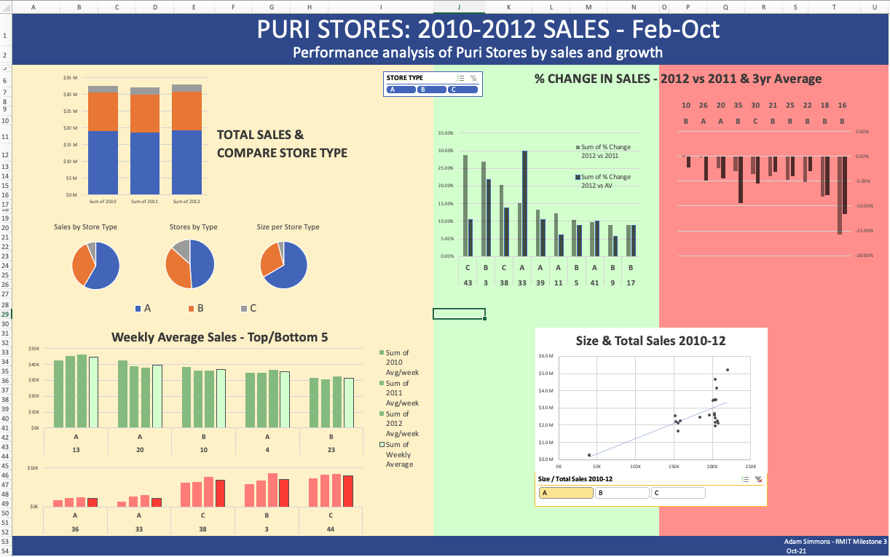
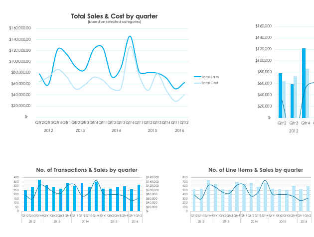
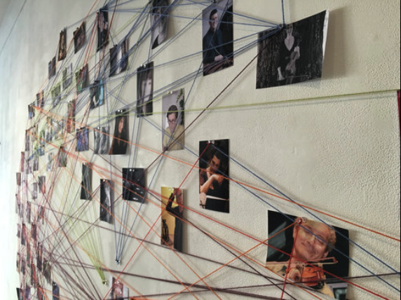
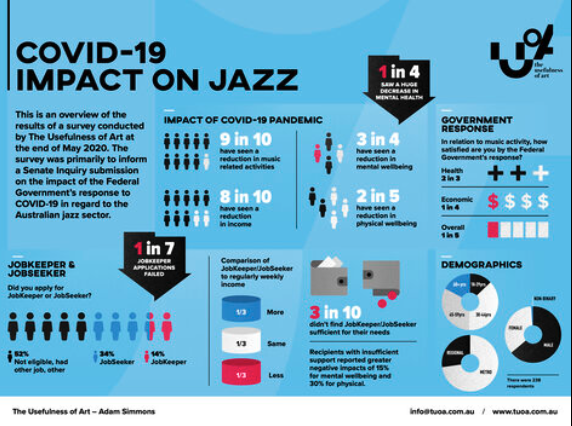

Here are some other examples of my data exploits over the years. 

 

<table cellpadding="40" cellspacing="20">

<tr>
<td align="center" width="45%">

</td>
<td width="10%">
</td>
<td align="center" width="45%">

</td>
</tr>

<tr>
<td valign="top">
October 25, 2021

My first Excel dashboard, built on lots of data cleaning, pivot tables, filters. This was a milestone for my RMIT Future Skills Visualisation with Excel and Tableau course, looking at the sales performance and forecasting across a fictitious chain of department stores. You'll see what I did a couple of weeks later in the Tableau projects
</td>
<td>
</td>
<td valign="top">
October 13, 2022

And here's an excerpt from another Excel dashboard - almost a year later than the Puri Stores one. This is looking at retail sales data, gathered via API from a Python script I created, which also appends the data to a SQL database before running the main query (using SQLalchemy), going through a cleaning pipeline to produce a final master Excel file - and then its just a matter of hitting refresh in the dashboard file to get the latest reports.
</td>
</tr>

</tr>
<tr height="100px">
<td>
</td>
</tr>

<tr>
<td align="center" width="45%">
{target="_blank"}
</td>
<td width="10%">
</td>
<td align="center" width="45%">
{target="_blank"}
</td>
</tr>

<tr>
<td valign="top">
November 2-30, 2015

In 2015, Ass. Professor John Fitzgerald and I collaborated on a somewhat crazy project involving me playing duets with 100 different Melbourne artists, gathering data along the way for social network analysis across the cohort which spanned rock, jazz, classical, world, folk, blue, experimental styles. We used Gephi platform for our analysis, which elicited some interesting insights on nature of idenity amongst other things. Our research was presented at The 1st Australian Social Network Analysis Conference at Swinburne University (2016) and has drawn diverse interest from the likes of the Australian Music Vault and the Singapore Government. Click on the pic to go to the event or [check out this article](https://www.tuoa.com.au/blog/fit-for-purpose-funding-the-creative-economy-beyond-venues-and-stars){target="_blank} on some of our insights.

</td>

<td>
</td>

<td valign="top">
May 28 - August 20, 2020

Another example of how involved I've been with data prior to my more formal data study, is my submission to the Senate Inquiry into the impact of the Government's response to COVID-19 (which seems crazy that the deadline was end of May 2020!). Given the way the arts was impacted by COVID and the lack of Government support, I wanted to do something for my community. I knew that data would be more impactful than just anecdotal evidence, so I conducted a national survey using Survey Monkey and worked with Celsius Design to create the visualisation/infographic. Of particular concern was the reported total disconnect between the jazz community and all through levels of government - something that has not been addressed as yet by the new National Cultural Policy. [Have a read...](https://www.tuoa.com.au/blog/survey-results-australian-jazz-amp-covid-19){target="_blank"}

</td>
</tr>
</table>

 

