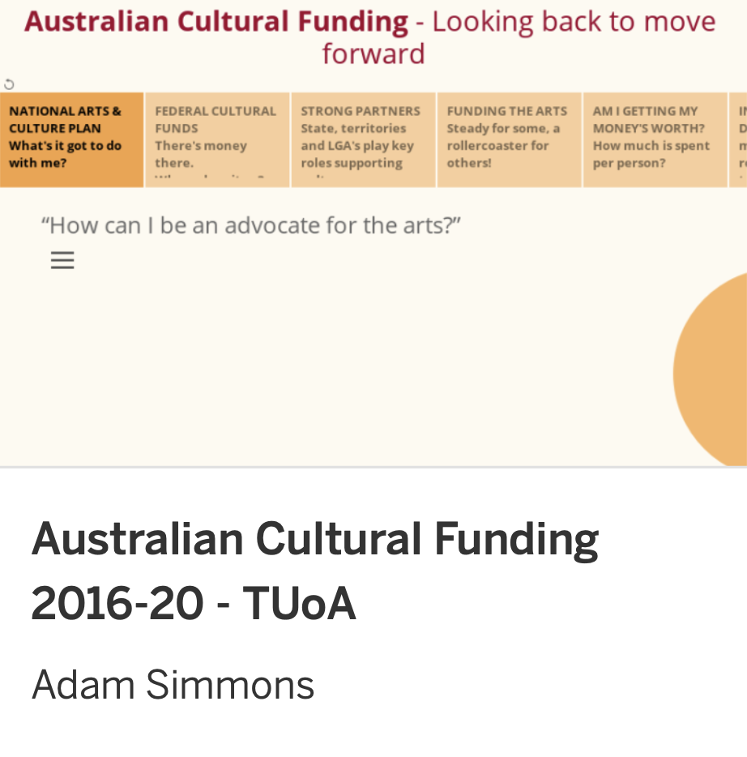

A collection of my early Tableau stories - it is a fun and powerful data viz tool!

Click on an image to visit a project hosted on Tableau Public - best viewed on desktop as full screen view. 

 

<table cellpadding="40" cellspacing="20">

<tr>
<td align="center" width="45%">
{target="_blank"}
</td>
<td width="10%">
</td>
<td align="center" width="45%">
{target="_blank"}
</td>
</tr>

<tr>
<td valign="top">
October 31, 2021

My first Tableau data viz as part of my RMIT Future Skills Business Analytics course, looking at the sales performance and forecasting across a fictitious chain of department stores. I did get creative visually with this one, though I have come to understand the need to put clarity of purpose to the forefront.
</td>
<td>
</td>
<td valign="top">
November 4, 2021

A hypothetical client is looking for advice about where to invest in short-term rental accom. My aim here was to be more corporate in design, clean and simple in message and delivery. The data for this was actually from a NY AirBnB dataset, adapted to Australia, 
</td>
</tr>

</tr>
<tr height="100px">
<td>
</td>
</tr>

<tr>
<td align="center" width="45%">
{target="_blank"}
</td>
<td width="10%">
</td>
<td align="center" width="45%">
{target="_blank"}
</td>
</tr>

<tr>
<td valign="top">
November 14, 2021

For my third and final porject for RMIT Future Skills, I used Australian Cultural Funding data from the Office of the Arts (Australian Bureau of Stasitics data). Given the audience were intended to be creatively minded, I pushed into the "d-art-a" side of things. I had an agenda, but I wwanted this to be a non-partisan tool to explore and learn from.
</td>

<td>
</td>

<td valign="top">
January 24, 2022

A bit of a look at the characteristics of the Top 100 Jazz tracks according to Spotify's defined metrics. Click your way around and you can see metrics for just one track or compare two or more selected tracks. Getting the data was fun too - using Python to scrape the data from the web, then using Spotify's API to feed the names in to to get the unique identifiers, use those to create a playlist, and then get all the metrics for the complete list. Tableau was the easy bit! 
</td>
</tr>
</table>

 

