December 29, 2021

This was my final project for my RMIT Future Skills Business Analytics with SQL and Python - and I used both for this project to explore Department of Transports [Victorian Integrated Survey of Travel (VISTA)](https://dtp.vic.gov.au/about/data-and-research/vista){target="blank} data. It covered about six years of data on who, where, when, why and how Victorians travel. I decided to consider the question of where electric vehicle chargers might be in demand based on where vehicle drivers travel to. 

The data comes in a series of separate but related tables in CSV format including a key of how it all fits together - a relational database . I didn't need all of the variables, but to get what I did need, I created a database in MySQL, used SQL querying with joins to extract those variables I needed (which occasionally got updated, thus having the stored query made it all so much easier), and then all of my data analysis and visualisation was conducted in Python, and presented in PowerPoint.

There was a lot of data wrangling, string cleaning and transformation of data, such as create age and household income bands, experimenting with a range of different plots in Matplotlib, Seaborn and I discovered Plotly and Plotly Express. There was some machine learning using moving averages and ARIMA modelling for forecasting - though as the data was all pre-COVID, all of that was out the window anyway!

I wanted to push myself with both SQL and Python - and I did... I had to ask my tutor how to upload the dataset into the RMIT's virtual MySQL, but apparently I was the first student my tutor had known who sourced their own dataset and she didn't know if it was possible. So, it meant I had to install everything locally, create my SQL database and prepare my main dataset. The fact I got stuck in COVID isolation (waiting for a test result during the post-Christmas fiasco, that ultimately was negative) meant I just had more time to explore. 

 

Below are the slides used for my final PowerPoint presentation with a couple of Python code blocks at the end:

 

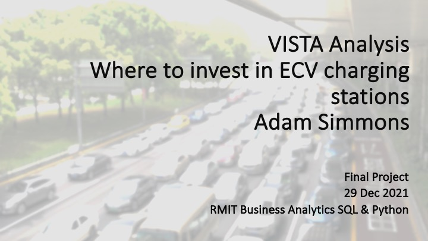

 

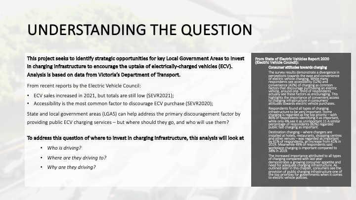

 

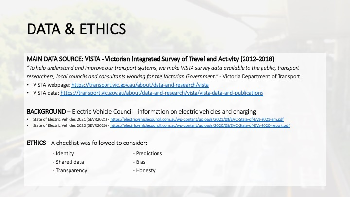

 

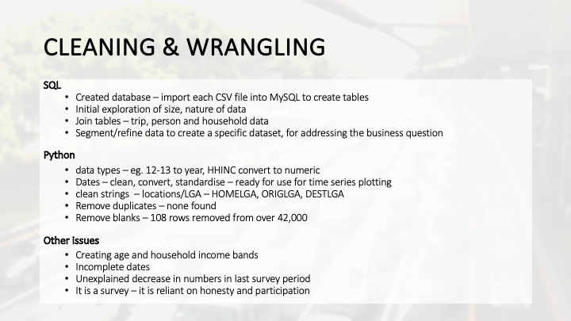

 

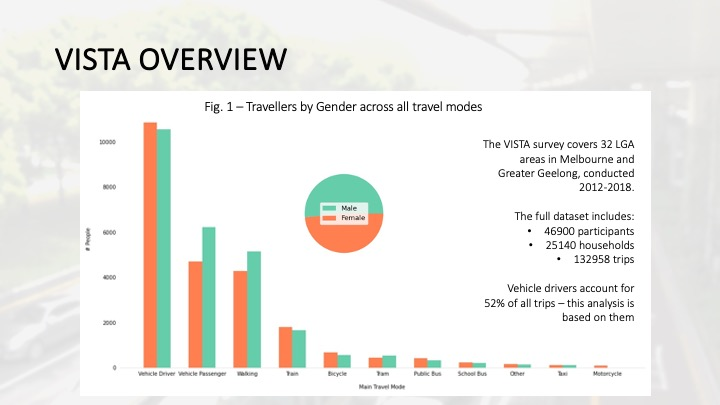

 

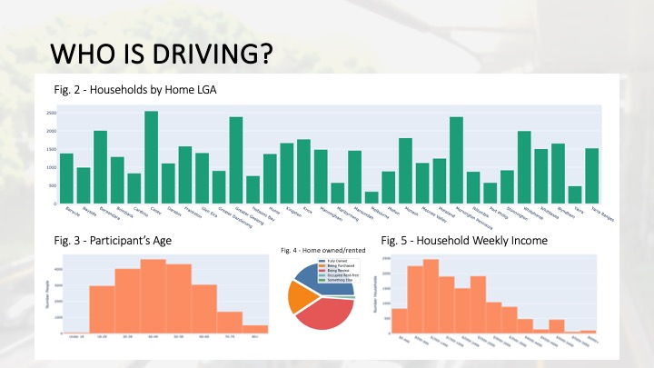

 

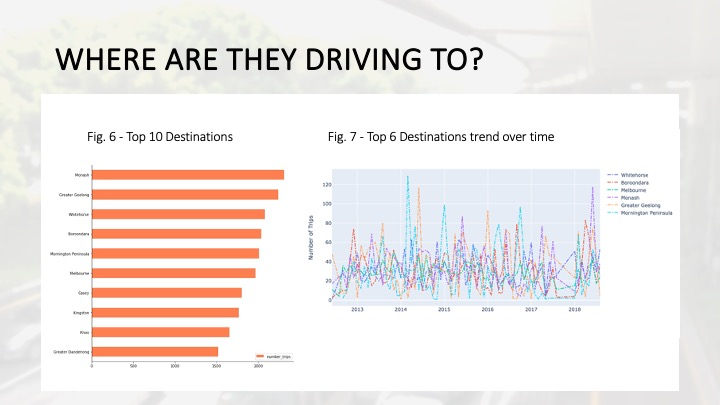

 

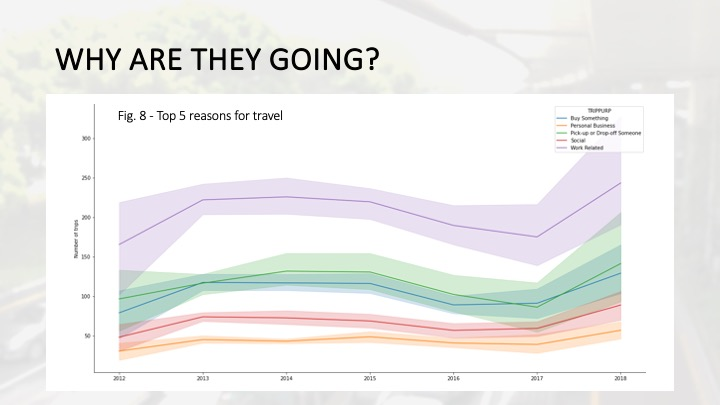

 

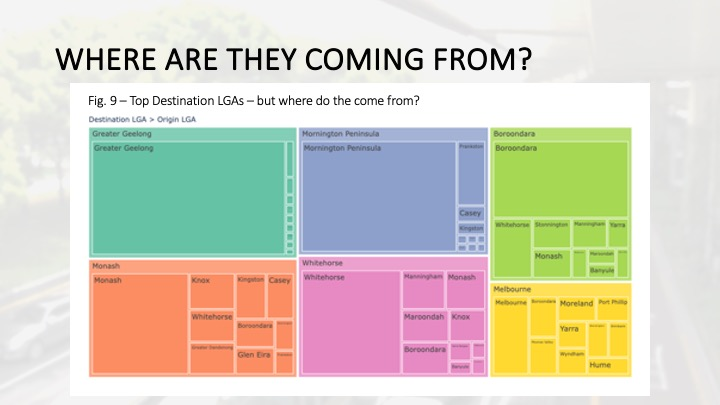

 

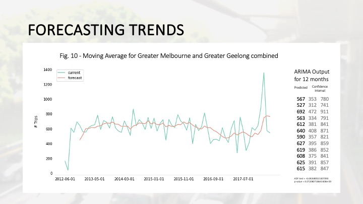

 

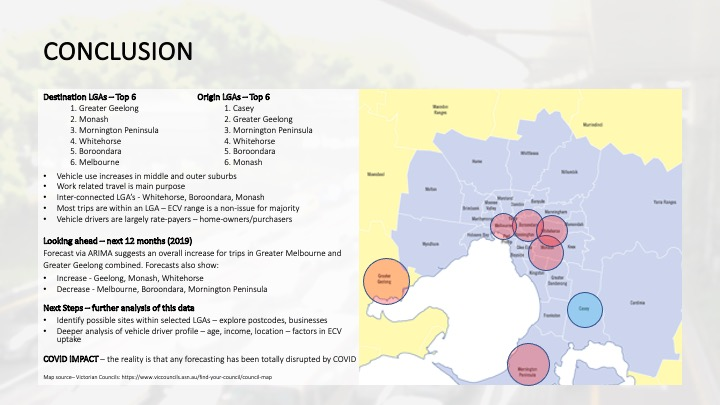

 
 

And a couple of examples of my Python coding in Jupyter Notebook:

 
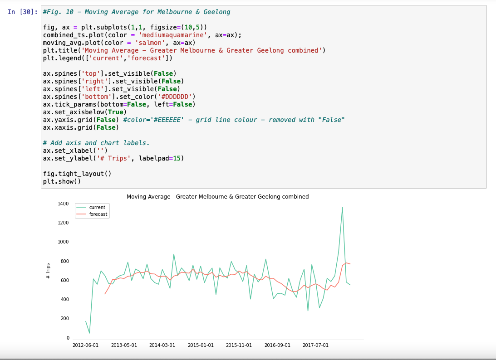

 

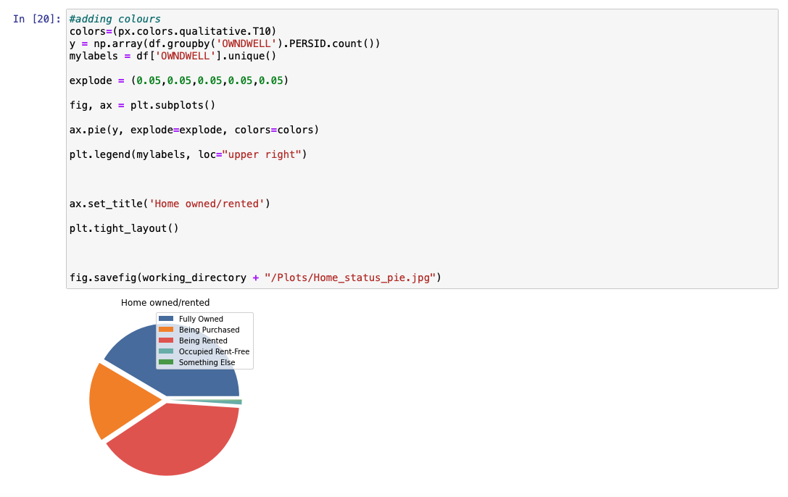

